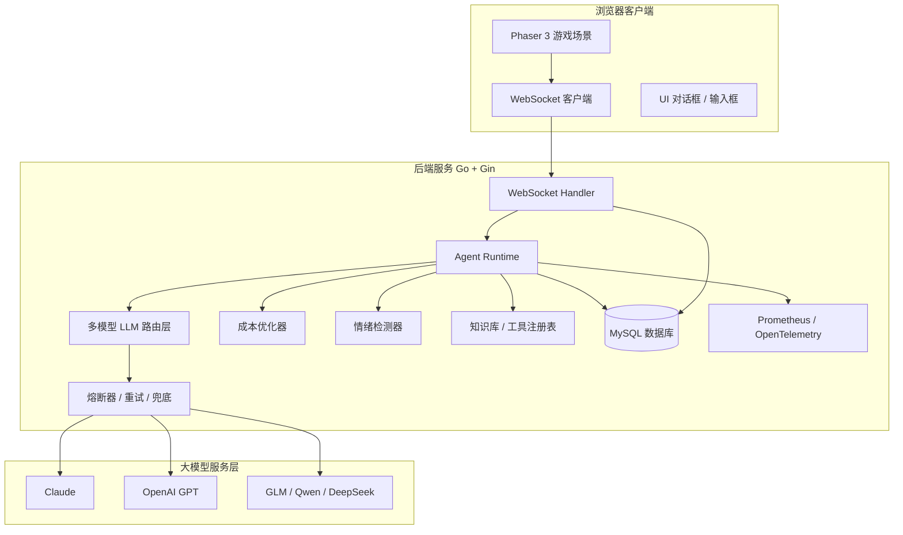
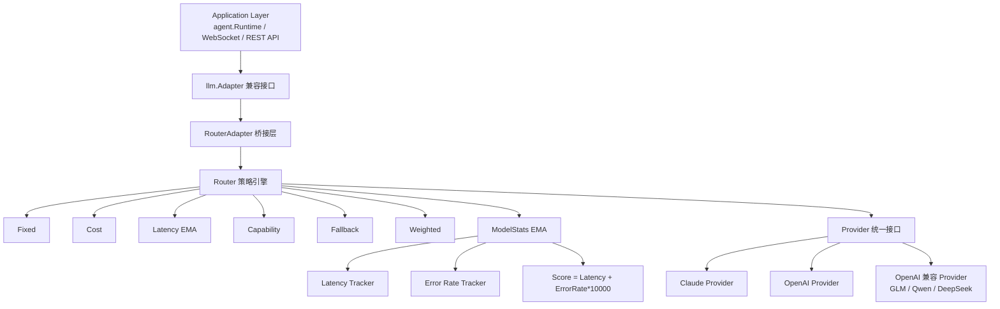
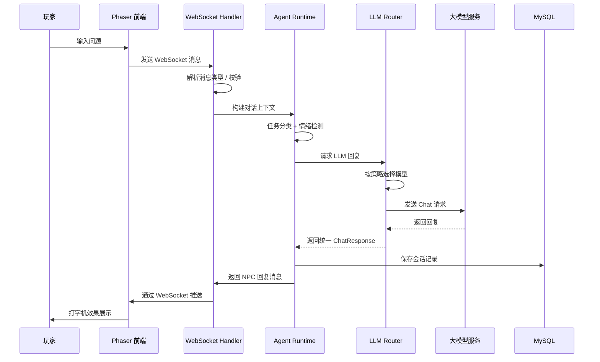
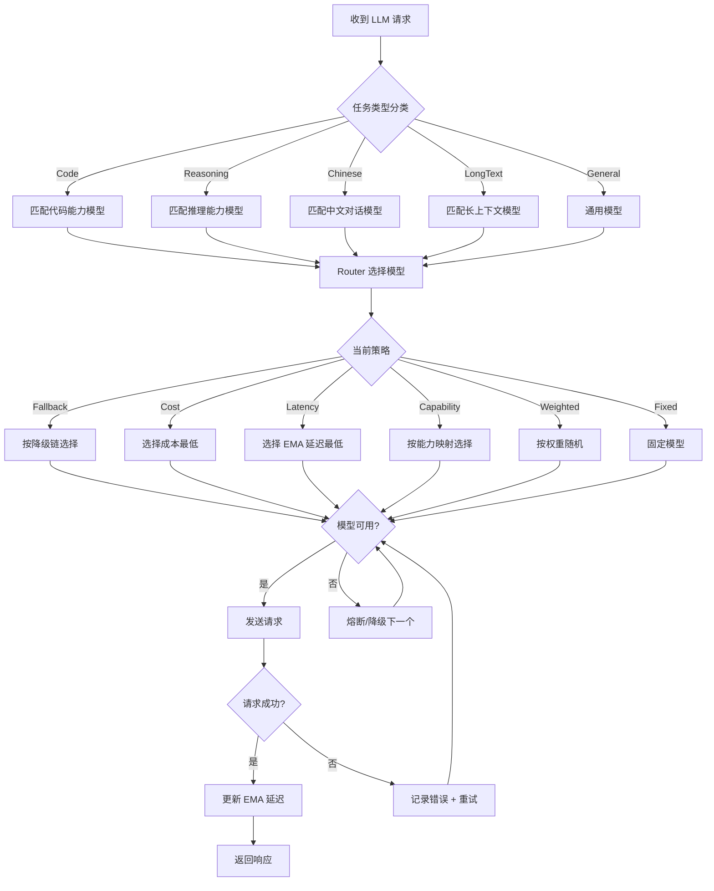

# 江南水乡智能导游系统

> 一个基于 **Go + Gin + WebSocket + 多模型 LLM 路由** 的 AI 游戏 NPC 导游项目，前端使用 **Phaser 3** 构建 2D 像素水乡场景，实现玩家与智能 NPC 的实时沉浸式对话。

[](https://golang.org/)
[](https://gin-gonic.com/)
[](https://phaser.io/)
[](./LICENSE)

---

## 目录

- [项目简介](#项目简介)
- [效果预览](#效果预览)
- [核心亮点](#核心亮点)
- [技术架构](#技术架构)
- [系统流程图](#系统流程图)
- [项目结构](#项目结构)
- [快速开始](#快速开始)
- [部署方式](#部署方式)
- [技术亮点](#技术亮点)
- [文档索引](#文档索引)

---

## 项目简介

江南水乡智能导游系统是一个**游戏化 + AI 对话**的实战项目。玩家通过浏览器进入一个江南水乡的 2D 场景，与 NPC 导游"小荷"进行实时对话。后端基于 WebSocket 提供长连接服务，并通过自研的多模型 LLM 路由系统接入 Claude、OpenAI、GLM、通义千问等多个模型，实现智能、稳定、低成本的对话体验。

### 应用场景

- 游戏 NPC 智能对话
- 景区智能导游 / 虚拟导览
- 多模型 AI 中台路由层
- 实时 WebSocket 聊天服务

---

## 效果预览

> 截图请放入 `docs/images/` 目录，替换下方占位图片。

### 游戏主界面


### NPC 对话效果


---

## 核心亮点

| 亮点 | 说明 |
|------|------|
| **多模型智能路由** | 6 种路由策略（Fixed / Cost / Latency / Capability / Fallback / Weighted），支持自动降级 |
| **EMA 运行时统计** | 指数移动平均跟踪模型延迟与错误率，动态优化路由决策 |
| **任务分类器** | 根据消息内容自动识别 Code / Reasoning / Chinese / LongText / General 任务类型 |
| **实时工具调用** | 支持 Function Calling，例如询问天气时自动调用 `get_weather` 工具 |
| **成本优化** | 相似问题缓存、历史消息摘要、Token 估算、成本计算 |
| **企业级可用性** | 熔断器 + 多模型降级链 + 自动重试 + FallbackAdapter 兜底 |
| **可观测性** | Prometheus 指标 + OpenTelemetry 分布式追踪 + 审计日志 |
| **多租户支持** | 租户隔离、独立资源池、审计日志 |

---

## 技术架构

### 整体架构图



### 后端架构图



---

## 系统流程图

### 1. WebSocket 对话流程



### 2. 多模型路由决策流程



### 3. 服务启动流程

```mermaid
flowchart LR
    A[main.go] --> B[加载配置]
    B --> C[初始化日志]
    C --> D[连接 MySQL]
    D --> E[加载知识库]
    E --> F[初始化 OpenTelemetry]
    F --> G[创建 Gin Server]
    G --> H[初始化 Agent Runtime]
    H --> I[注册 WebSocket Handler]
    I --> J[启动 HTTP 服务]
    J --> K[等待退出信号]
    K --> L[优雅关闭]
```



---

## 项目结构

```
taohuawu/
├── backend/                          # Go 后端服务
│   ├── cmd/server/main.go            # 程序入口
│   ├── internal/
│   │   ├── server/                   # Gin HTTP + WebSocket 服务
│   │   ├── agent/                    # Agent 运行时、会话、工具、Prompt
│   │   ├── llm/                      # 多模型路由层
│   │   │   ├── model/                # 统一数据模型
│   │   │   ├── router/               # 路由策略引擎
│   │   │   └── providers/            # Provider 实现
│   │   ├── cost/                     # 成本优化
│   │   ├── emotion/                  # 情绪检测
│   │   ├── database/                 # 数据库层
│   │   ├── knowledge/                # 知识库
│   │   ├── observability/            # 可观测性
│   │   └── config/                   # 配置管理
│   ├── pkg/                          # 工具包
│   ├── docs/                         # 后端文档
│   ├── examples/                     # 使用示例
│   ├── configs/                      # 配置文件
│   └── README.md
├── frontend/                         # 前端游戏
│   ├── index.html
│   ├── js/                           # 游戏逻辑
│   │   ├── main.js
│   │   ├── scenes/                   # Phaser 场景
│   │   ├── entities/                 # NPC / Player
│   │   ├── ui/                       # 对话框、输入框、打字机
│   │   ├── network/                  # WebSocket 客户端
│   │   └── utils/                    # 常量配置
│   ├── css/
│   ├── assets/
│   └── README.md
├── docker-compose.yml                # 本地一键启动
├── render.yaml                       # Render 部署配置
├── RENDER_DEPLOY.md                  # Render 部署指南
└── README.md                         # 本文件
```

---

## 快速开始

### 1. 本地 Docker 启动（推荐）

```bash
# 设置 GLM API Key（或其他兼容 OpenAI 格式的 API Key）
export GLM_API_KEY="your-glm-api-key"

# 启动全部服务（MySQL + 后端 + 前端）
docker-compose up --build

# 访问游戏
open http://localhost:3000
```

### 2. 后端单独启动

```bash
cd backend
go mod download
go run cmd/server/main.go
```

服务默认运行在 `http://localhost:8080`，WebSocket 地址为 `ws://localhost:8080/ws/game`。

### 3. 前端单独启动

```bash
cd frontend
npm install
npm run dev
```

访问 `http://localhost:8084`。

---

## 部署方式

| 方式 | 文件 | 说明 |
|------|------|------|
| Docker Compose | `docker-compose.yml` | 本地开发 / 测试一键启动 |
| Render 云平台 | `render.yaml` | 免费部署，适合展示 |
| 手动部署 | `backend/Dockerfile` + `frontend/nginx.conf` | 生产环境自定义部署 |

详细部署文档见：
- [Render 部署指南](./RENDER_DEPLOY.md)
- [后端 README](./backend/README.md)
- [前端 README](./frontend/README.md)

---

## 技术亮点

### 你可以重点讲这些技术点

1. **多模型路由架构**
   - 为什么要做路由层？解耦应用层和具体模型。
   - 6 种策略分别解决了什么问题？成本、延迟、可用性、A/B 测试。
   - 降级链设计：可用性优先于成本，主模型 → 备选 → 低成本兜底。

2. **EMA 动态统计**
   - 公式：`newEMA = 0.3 × currentSample + 0.7 × previousEMA`
   - 意义：快速响应新数据，同时保持历史稳定性，避免单次抖动影响决策。
   - 综合评分：`Score = Latency + ErrorRate × 10000`，错误率放大权重快速降级高错误模型。

3. **任务分类与能力映射**
   - 优先级：Code > Reasoning > Chinese > LongText > General
   - 让不同模型各司其职，例如 Claude 处理代码、OpenAI 处理中文对话。

4. **Function Calling 工具调用 + Agent 设计模式**
   - 以天气查询为例，演示 LLM 如何自动决策并调用外部 API。
   - 工具注册表（Registry）集中管理工具，策略模式（Strategy）让不同工具实现统一接口。
   - 适配器模式（Adapter）通过 `llm.Adapter` 统一接入 Claude / OpenAI / Fallback。
   - 依赖注入（DI）让 `Runtime` 依赖通过构造函数传入，便于测试和替换。
   - ReAct 循环：LLM 决策 → 工具执行 → 结果回传 → 生成最终回复。

5. **成本优化**
   - 相似问题缓存：命中缓存直接返回，减少 API 调用。
   - 历史消息摘要：长对话超过阈值后自动摘要，减少 token 消耗。
   - Token 估算：每 4 字符约 1 token，中文按字节估算，无需调用即可估算成本。

6. **高可用设计**
   - 熔断器：连续失败达到一定阈值后快速失败，半开恢复。
   - 多模型降级：单模型故障不影响服务。
   - FallbackAdapter：所有模型失败时返回预设兜底回复。

7. **可观测性**
   - Prometheus 指标暴露 `/metrics`。
   - OpenTelemetry 分布式追踪接入。
   - 审计日志支持多租户查询。

8. **前端游戏化交互**
   - Phaser 3 2D 场景 + 像素风。
   - WebSocket 实时通信 + 自动重连 + 心跳保活。
   - 打字机效果、情绪状态展示提升沉浸感。

---

## 文档索引

| 文档 | 说明 |
|------|------|
| [后端 README](./backend/README.md) | 后端详细说明、API、开发指南 |
| [前端 README](./frontend/README.md) | 前端游戏架构、模块说明、部署 |
| [多模型路由系统](./backend/docs/MULTI_MODEL_ROUTER.md) | 路由层完整架构与设计决策 |
| [多模型配置说明](./backend/MODEL_CONFIG.md) | 配置参数、环境变量、路由策略 |
| [Render 部署指南](./RENDER_DEPLOY.md) | 云平台部署步骤 |

---

## 许可证

MIT License
