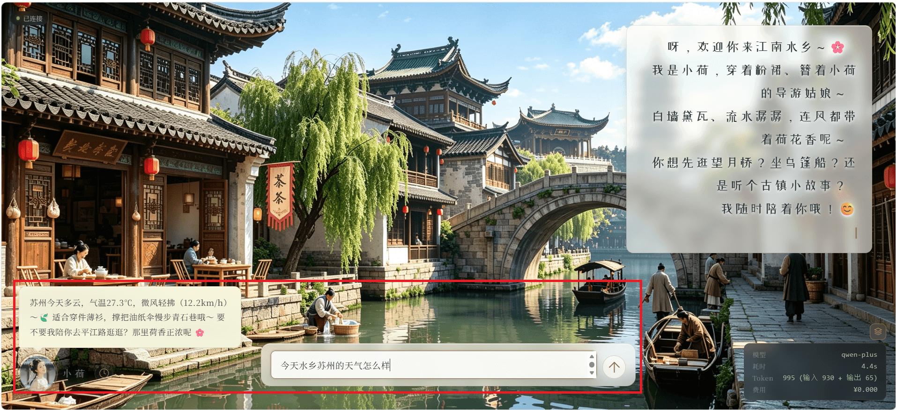
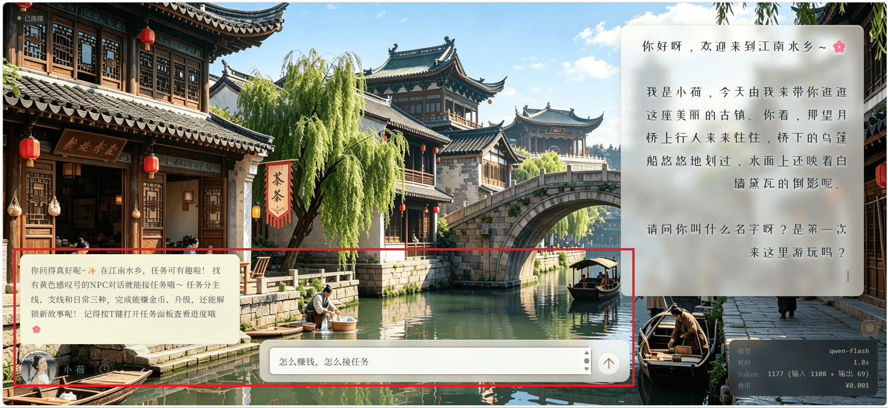
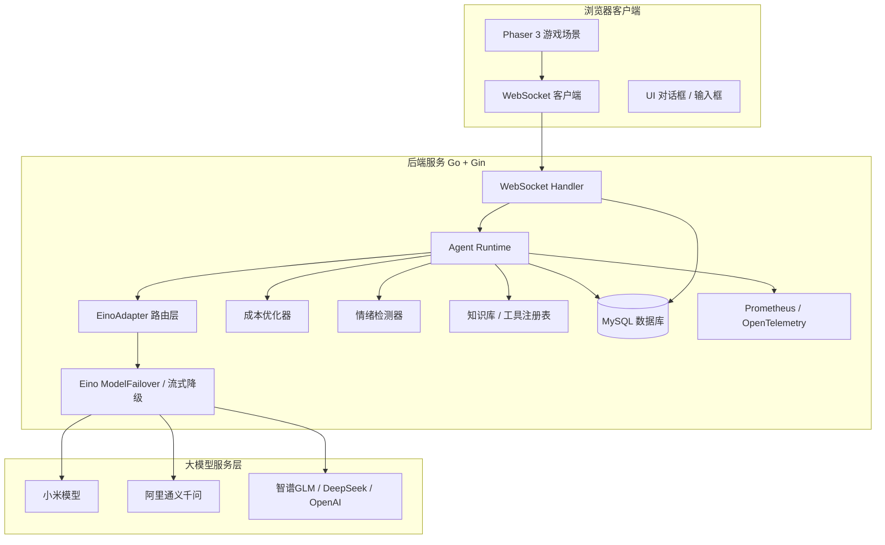
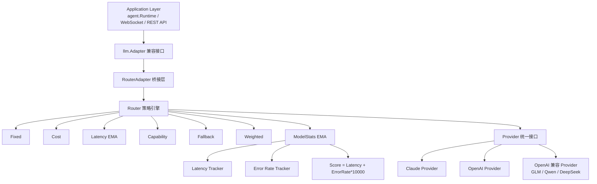
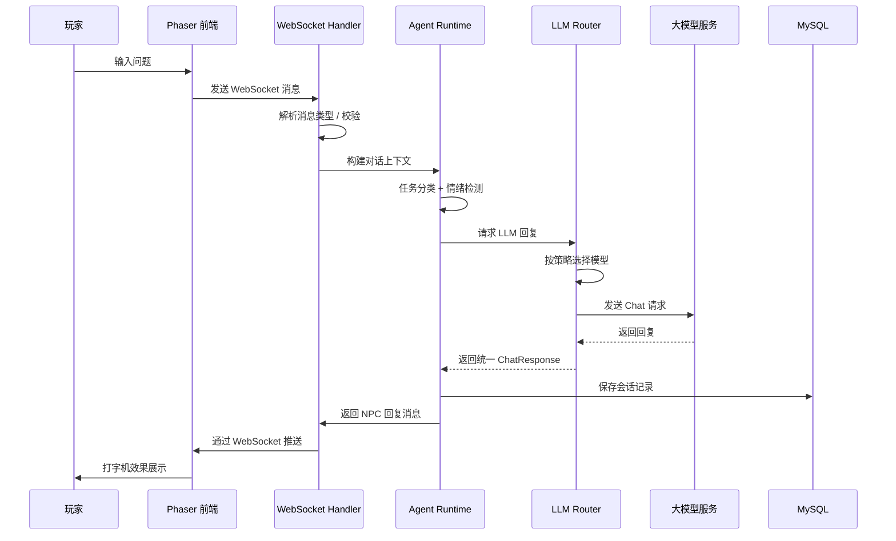
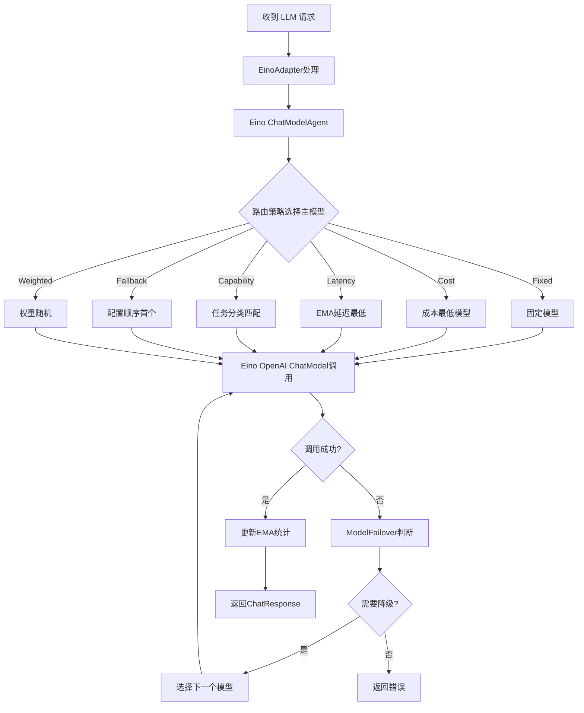
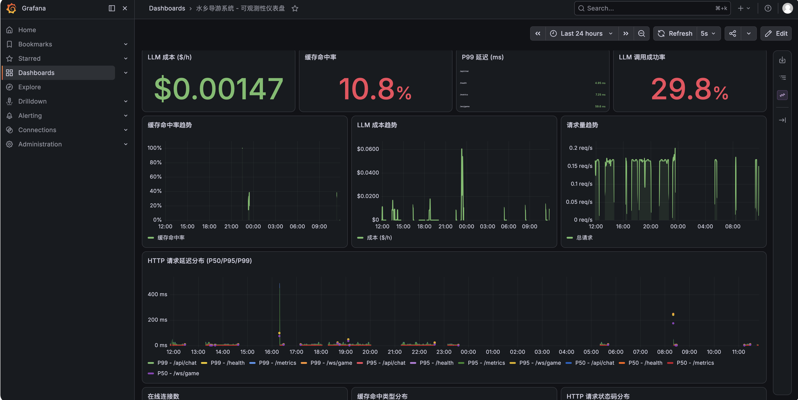
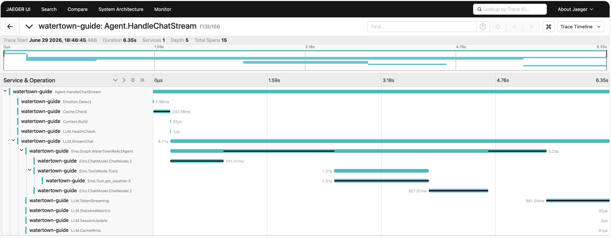

# 江南水乡智能导游系统

> 一个基于 **Go + Gin + WebSocket + 多模型 LLM 路由** 的 AI 游戏 NPC 导游项目，前端使用 **Phaser 3** 构建 2D 像素水乡场景，实现玩家与智能 NPC 的实时沉浸式对话。

[](https://golang.org/)
[](https://gin-gonic.com/)
[](https://phaser.io/)
[](./LICENSE)

---

## 目录

- [项目简介](#项目简介)
- [效果预览](#效果预览)
- [核心亮点](#核心亮点)
- [技术架构](#技术架构)
- [系统流程图](#系统流程图)
- [项目结构](#项目结构)
- [快速开始](#快速开始)
- [部署方式](#部署方式)
- [技术亮点](#技术亮点)
- [文档索引](#文档索引)

---

## 项目简介

江南水乡智能导游系统是一个**游戏化 + AI 对话**的实战项目。玩家通过浏览器进入一个江南水乡的 2D 场景，与 NPC 导游"小荷"进行实时对话。后端基于 WebSocket 提供长连接服务，并基于 Eino 框架构建多模型 LLM 路由系统，实现智能、稳定、低成本的对话体验。

### 应用场景

- 游戏 NPC 智能对话
- 景区智能导游 / 虚拟导览
- 多模型 AI 中台路由层
- 实时 WebSocket 聊天服务

---

## 效果预览

### 游戏主界面


### NPC使用实时天气工具



### NPC使用rag查询游戏规则



---

## 核心亮点

| 亮点 | 说明 |
|------|------|
| **多模型智能路由** | 基于 Eino 框架，统一多模型接入，支持 6 种路由策略和自动降级 |
| **Eino ModelFailover** | 内置故障转移和重试机制，简化配置，提高可靠性 |
| **任务分类器** | 根据消息内容自动识别 Code / Reasoning / Chinese / LongText / General 任务类型 |
| **实时工具调用** | 支持 Function Calling，例如询问天气时自动调用 `get_weather` 工具 |
| **成本优化** | 相似问题缓存、历史消息摘要、Token 估算、成本计算 |
| **可用性** | Eino ModelFailover + 流式降级 + FallbackAdapter 兜底 |
| **可观测性** | Prometheus 指标 + OpenTelemetry 分布式追踪 + 审计日志 + Langfuse（LLM 专项），详见 [可观测性指南](./backend/docs/OBSERVABILITY.md) |

---

## 技术架构

### 整体架构图



### 后端架构图



---

## 系统流程图

### 1. WebSocket 对话流程



### 2. 多模型路由决策流程（基于 Eino）



### 3. 服务启动流程

```mermaid
flowchart LR
    A[main.go] --> B[加载配置]
    B --> C[初始化日志]
    C --> D[连接 MySQL]
    D --> E[加载知识库]
    E --> F[初始化 OpenTelemetry]
    F --> G[创建 Gin Server]
    G --> H[初始化 Agent Runtime]
    H --> I[注册 WebSocket Handler]
    I --> J[启动 HTTP 服务]
    J --> K[等待退出信号]
    K --> L[优雅关闭]
```



---

## 项目结构

```
taohuawu/
├── backend/                          # Go 后端服务
│   ├── cmd/server/main.go            # 程序入口
│   ├── internal/
│   │   ├── server/                   # Gin HTTP + WebSocket 服务
│   │   ├── agent/                    # Agent 运行时、会话、工具、Prompt
│   │   ├── llm/                      # 多模型路由层（基于 Eino）
│   │   │   ├── model/                # 统一数据模型
│   │   │   ├── router/               # 路由策略引擎
│   │   │   ├── multi_model_adapter.go  # EinoAdapter 实现
│   │   │   ├── adapter.go            # Adapter 接口定义
│   │   │   └── fallback_adapter.go   # FallbackAdapter 兜底实现
│   │   ├── cost/                     # 成本优化
│   │   ├── emotion/                  # 情绪检测
│   │   ├── database/                 # 数据库层
│   │   ├── knowledge/                # 知识库
│   │   ├── observability/            # 可观测性
│   │   └── config/                   # 配置管理
│   ├── pkg/                          # 工具包
│   ├── docs/                         # 后端文档
│   ├── configs/                      # 配置文件
│   └── README.md
├── frontend/                         # 前端游戏
│   ├── index.html
│   ├── js/                           # 游戏逻辑
│   │   ├── main.js
│   │   ├── scenes/                   # Phaser 场景
│   │   ├── entities/                 # NPC / Player
│   │   ├── ui/                       # 对话框、输入框、打字机
│   │   ├── network/                  # WebSocket 客户端
│   │   └── utils/                    # 常量配置
│   ├── css/
│   ├── assets/
│   └── README.md
├── deploy/                           # 部署配置
│   ├── docker-compose.yml            # 本地一键启动
│   ├── render.yaml                   # Render 部署配置
│   └── RENDER_DEPLOY.md              # Render 部署指南
├── scripts/                          # 启动脚本
│   ├── start.sh                      # Linux/Mac 启动脚本
│   └── start.ps1                     # Windows 启动脚本
└── README.md                         # 本文件
```

---

## 可观测性指南

本项目提供完整的 **Metrics + Traces + Logs + LLM 专项可观测** 能力，基于 **Prometheus** 暴露指标、**OpenTelemetry** 采集链路、**Langfuse** 专项追踪 LLM 调用，并通过 **审计日志** 记录关键操作。你可以用它监控 LLM 调用成本、WebSocket 连接状态、HTTP 接口性能、缓存命中率以及全链路延迟。

- **Metrics**：告诉你系统"发生了什么"，例如 QPS、延迟、错误率、Token 消耗、成本、缓存命中率。
- **Traces**：告诉你"一次请求经历了什么"，例如 WebSocket 消息经过哪些函数、每个阶段耗时多久。
- **LLM 专项可观测（Langfuse）**：告诉你"每次 LLM 调用的完整细节"，包括输入 Prompt、输出内容、Token 数、成本、用户反馈。
- **Logs**：审计日志记录谁在什么时间做了什么操作，已在 `/api/v1/audit` 提供查询。

## 1. Prometheus 指标清单

### 1.1 HTTP 层指标（中间件自动采集）

| 指标名称 | 类型 | 标签 | 说明 |
|---|---|---|---|
| `http_requests_total` | Counter | `method`, `path`, `status` | HTTP 请求总数 |
| `http_request_duration_seconds` | Histogram | `method`, `path` | HTTP 请求耗时分布 |
| `http_requests_in_flight` | Gauge | - | 当前正在处理的 HTTP 请求数 |

### 1.2 Agent 层指标

| 指标名称 | 类型 | 标签 | 说明 |
|---|---|---|---|
| `agent_requests_total` | Counter | `action`, `status` | Agent 调用次数：`action=welcome/chat`，`status=success/error` |
| `agent_request_duration_seconds` | Histogram | `action` | Agent 处理耗时 |

### 1.3 LLM 层指标

| 指标名称 | 类型 | 标签 | 说明 |
|---|---|---|---|
| `llm_requests_total` | Counter | `model`, `status` | 每个模型的调用次数与状态 |
| `llm_request_duration_seconds` | Histogram | `model` | 每个模型的调用耗时 |
| `llm_request_tokens_total` | Counter | `model` | 每个模型的输入 Token 累计 |
| `llm_completion_tokens_total` | Counter | `model` | 每个模型的输出 Token 累计 |
| `cost_total` | Counter | `model` | 每个模型的累计成本（美元） |

### 1.4 WebSocket 层指标

| 指标名称 | 类型 | 标签 | 说明 |
|---|---|---|---|
| `websocket_connections` | Gauge | `tenant_id` | 每个租户的当前活跃连接数 |
| `websocket_messages_total` | Counter | `type`, `direction` | WebSocket 消息总数：`direction=in/out` |

### 1.5 缓存层指标

| 指标名称 | 类型 | 标签 | 说明 |
|---|---|---|---|
| `cache_hits_total` | Counter | `cache_type` | 缓存命中次数（精确匹配/语义匹配） |
| `cache_misses_total` | Counter | `tenant_id` | 缓存未命中次数 |
| `cache_hit_ratio` | Gauge | `tenant_id` | 缓存命中率 |

以下是使用 Grafana 展示的指标大盘效果：



---

## 2. OpenTelemetry 分布式追踪

### 2.1 已接入的 Span

| 位置 | Span 名称 | 说明 |
|---|---|---|
| `middleware.go` | `GET /path` / `POST /path` | 每个 HTTP 请求自动创建 Server Span |
| `runtime.go` | `HandleWelcome` | 欢迎消息处理 |
| `runtime.go` | `HandleChat` | 普通对话处理 |
| `runtime.go` | `HandleChatStream` | 流式对话处理（包含 5 个顶层子 Span + Eino 框架嵌套子 Span） |

### 2.2 细粒度链路追踪（HandleChatStream）

为实现**全链路耗时透明化**，我们为 `HandleChatStream` 添加了 **5 个顶层细粒度子 Span**，其中 `LLM.StreamChat` 内部还包含 **4-5 个嵌套子 Span**，可以清晰看到每个步骤的耗时分布，便于定位性能瓶颈：

#### 完整 Span 层级结构

```
Agent.HandleChatStream (主 Span)
├── Emotion.Detect          情绪检测
├── Cache.Check             缓存查询（含精确缓存查询 + Embedding 调用）
├── Context.Build           构建上下文消息（会话历史 + 摘要压缩）
├── LLM.HealthCheck         LLM 健康检查
└── LLM.StreamChat          LLM 流式调用（主要耗时来源，包含嵌套子 Span）
    ├── Eino.Graph.WaterTownReActAgent   Eino ReAct Agent 执行图
    │   ├── Eino.ChatModel.ChatModel.1   模型调用（决策阶段，判断是否调用工具）
    │   ├── Eino.ToolNode.Tools          工具调用节点
    │   │   └── Eino.Tool.get_weather    具体工具执行
    │   └── Eino.ChatModel.ChatModel.2   模型调用（响应阶段，基于工具结果生成回复）
    ├── LLM.TokenStreaming              Token 流传输（打字机效果）
    ├── LLM.StatsAndMetrics             统计指标记录与成本计算
    │   └── LLM.FallbackNonStream       降级非流式调用（可选）
    ├── LLM.SessionUpdate               会话消息更新
    └── LLM.CacheWrite                  缓存写入（精确匹配 + 语义索引）
```


#### 输出效果（Jaeger Trace）



---

## 快速开始

### 1. 本地 Docker 启动（推荐）

```bash
# 设置 CLAUDE_API_KEY（或其他模型的 API Key，同时在 `configs/config-docker.yaml` 中添加对应的模型配置）
export CLAUDE_API_KEY="your-claude-api-key"

# 启动全部服务（postgres + 后端 + 前端 + Prometheus + Jaeger+ Grafana + LangFuse）
cd deploy && docker-compose up --build

# 访问游戏
open http://localhost:3000

# Prometheus UI（PromQL 查询指标）
open http://localhost:9090

# Jaeger UI（分布式追踪）
open http://localhost:16686

# Grafana 仪表盘（用户名：admin，密码：admin123）
open http://localhost:3001

# Langfuse 追踪（首次访问点击 Sign up 注册账户）
open http://localhost:3002
```

### 2. 后端单独启动

```bash
cd backend
go mod download
go run cmd/server/main.go
```

服务默认运行在 `http://localhost:8080`，WebSocket 地址为 `ws://localhost:8080/ws/game`。

### 3. 前端单独启动

```bash
cd frontend
npm install
npm run dev
```

访问 `http://localhost:8084`。

---

## 部署方式

| 方式 | 文件 | 说明 |
|------|------|------|
| Docker Compose | `deploy/docker-compose.yml` | 本地开发 / 测试一键启动 |
| Render 云平台 | `deploy/render.yaml` | 免费部署，适合展示 |
| 手动部署 | `backend/Dockerfile` + `frontend/nginx.conf` | 生产环境自定义部署 |

详细部署文档见：
- [Render 部署指南](./deploy/RENDER_DEPLOY.md)
- [后端 README](./backend/README.md)
- [前端 README](./frontend/README.md)

---

## 技术亮点

1. **多模型路由架构（基于 Eino）**
   - 基于 Eino 框架，所有模型统一通过 OpenAI 兼容接口接入。
   - 6 种策略（Fixed / Cost / Latency / Capability / Fallback / Weighted）动态选择最优模型。
   - Eino `ModelFailoverConfig` 提供内置故障转移和重试机制。
   - 简化配置：不再需要区分 Provider 类型（`type` 字段已删除）。

2. **EMA 动态统计**
   - 公式：`newEMA = 0.3 × currentSample + 0.7 × previousEMA`
   - 意义：快速响应新数据，同时保持历史稳定性，避免单次抖动影响决策。
   - 综合评分：`Score = Latency + ErrorRate × 10000`，错误率放大权重快速降级高错误模型。

3. **任务分类与能力映射**

   系统根据消息内容自动识别任务类型，按优先级 `Code > Reasoning > Chinese > LongText > General` 分类，并路由到最擅长该任务的模型。

   **任务分类规则**：
   - **Code**：检测代码关键词（`function`、`class`、`def`）、代码块标记 ` ``` `、特殊符号占比 > 30%
   - **Reasoning**：检测推理类关键词（`为什么`、`how`、`why`、`分析`、`推导`、`证明`）
   - **Chinese**：中文字符占比 > 30%（覆盖 CJK 统一表意文字区间）
   - **LongText**：Token 估算 > 2000（约 8000 英文字符或 2000 中文字符）
   - **General**：不满足以上任一条件时的兜底分类

   **2026年基准测试数据驱动的模型推荐**：

   | 任务类型 | Provider（按优先级） | 推荐模型 | 核心优势（2026年基准） |
   |----------|---------------------|----------|----------------------|
   | **Code** | `claude` → `openai` → `glm` → `qwen` | Claude 3.5 Sonnet、GPT-4o、GLM-4 Code、Qwen 2.0 Code | **Claude**：HumanEval 92.7%、MBPP 91.3%，代码生成顶级；**GPT-4o**：代码质量高，工具调用集成好；**GLM-4 Code**：国内代码能力最强 |
   | **Reasoning** | `claude` → `openai` → `gemini` → `glm` → `qwen` | Claude 3.5 Sonnet、GPT-4o、Gemini 1.5 Pro、GLM-4、Qwen 2.0 | **Claude**：GSM8K 95.2%、MATH 87.1%，复杂推理领先；**GPT-4o**：逻辑推理精准；**GLM-4**：国内推理最优 |
   | **Chinese** | `glm` → `qwen` → `claude` → `openai` | GLM-4、Qwen 2.0、Claude 3.5 Sonnet、GPT-4o | **GLM-4**：C-Eval 91.5%、CMMLU 90.2%，中文语义理解顶级；**Qwen 2.0**：中文生成流畅，性价比高 |
   | **LongText** | `claude` → `gemini` → `qwen` → `glm` → `openai` | Claude 3.5 Sonnet（200K）、Gemini 1.5 Pro（1M）、Qwen 2.0（128K）、GLM-4 | **Claude**：原生 200K 上下文，长文本理解最优；**Gemini**：支持 1M+ token，超长上下文处理 |
   | **General** | `claude` → `openai` → `glm` → `qwen` → `gemini` | Claude 3.5 Sonnet、GPT-4o、GLM-4、Qwen 2.0、Gemini 1.5 Flash | **Claude**：MT-Bench 8.9，综合能力强；**GPT-4o**：通用能力均衡；**Gemini Flash**：速度快，成本低 |

   **Provider 命名约定**：
   - `claude`：Anthropic Claude 系列（Claude 3.5 Sonnet）
   - `openai`：OpenAI GPT 系列（GPT-4o）
   - `glm`：智谱 GLM 系列（GLM-4）
   - `qwen`：通义千问系列（Qwen 2.0）
   - `gemini`：Google Gemini 系列（Gemini 1.5 Pro/Flash）

   > **配置方式**：通过 `SetCapabilityMap(taskType, []string{"provider1", "provider2"})` 灵活指定每个任务类型的 Provider 列表。  
   > **数据来源**：HumanEval、GSM8K、MATH、MT-Bench、C-Eval、CMMLU、LongBench（2026年最新数据）。  
   > **部署建议**：根据业务需求启用对应 Provider，系统自动选择第一个可用的模型。

4. **Function Calling 工具调用 + Agent 设计模式**
   - 以天气查询为例，演示 LLM 如何自动决策并调用外部 API。
   - 工具注册表（Registry）集中管理工具，策略模式（Strategy）让不同工具实现统一接口。
   - 适配器模式（Adapter）通过 `llm.Adapter` 统一接入所有模型。
   - Eino `BindTools` 方法统一处理工具绑定。
   - 依赖注入（DI）让 `Runtime` 依赖通过构造函数传入，便于测试和替换。
   - ReAct 循环：LLM 决策 → 工具执行 → 结果回传 → 生成最终回复。

5. **成本优化与 Memory 管理**
   
   系统实现了完整的 Memory 管理方案，优化对话成本并保持上下文连贯性。

   ### 5.1 相似问题缓存
   - 基于问题哈希的键值存储，命中缓存直接返回
   - 支持 Embedding 相似度匹配，语义相近的问题也能命中
   - Session 级别隔离，不同会话有独立缓存空间
   - TTL 自动过期清理

   ### 5.2 历史消息摘要（Memory 核心）
   采用**基于 LLM 的增量式摘要方案**，这是当前业界主流的一种方式：

   ```
   ┌─────────────────────────────────────────────────────────┐
   │                 增量式摘要流程                           │
   ├─────────────────────────────────────────────────────────┤
   │                                                          │
   │   新消息加入 ──► 检查 Token 数量 ──► 超过阈值？         │
   │         │                           │                    │
   │         │                           ▼                    │
   │         │                   ┌──────────────┐             │
   │         │                   │ 使用 LLM      │             │
   │         │                   │ 增量式摘要   │             │
   │         │                   └──────┬───────┘             │
   │         │                          │                     │
   │         ▼                          ▼                     │
   │   保留完整历史            [对话摘要] + 最近2条消息         │
   │                                                          │
   └─────────────────────────────────────────────────────────┘
   ```

   **核心特性**：
   - **Token 限制触发**：当历史消息 Token 数超过 `max_history_tokens`（默认 4096）时自动触发摘要
   - **消息数量限制**：当消息数超过 `max_history_messages`（默认 10）时触发摘要
   - **增量式更新**：保留已有摘要，仅对新消息进行摘要合并，无需重写全部历史
   - **保留上下文**：摘要后保留最近 2 条消息作为即时上下文
   - **降级方案**：LLM 摘要失败时自动回退到简单的滑动窗口策略

   **配置项**（`config.yaml`）：
   ```yaml
   cost:
     max_history_messages: 10    # 最大消息数量
     max_history_tokens: 4096    # 最大 Token 数量（触发摘要阈值）
     cache_ttl: 3600s           # 缓存过期时间
   ```

   ### 5.3 业界 Memory 方案对比

   | 方案 | 实现复杂度 | 上下文保留 | Token 效率 | 适用场景 |
   |------|----------|-----------|-----------|---------|
   | **滑动窗口** | 低 | 仅最近 N 条 | 中等 | 简单对话、短上下文 |
   | **规则关键词提取** | 中 | 依赖规则质量 | 中等 | 特定领域对话 |
   | **LLM 增量摘要** | 中高 | 完整（通过摘要） | 高（80%+压缩） | 长对话、多轮交互 |
   | **层次化摘要** | 高 | 完整（多级摘要） | 极高 | 超长对话、文档分析 |
   | **向量检索 RAG** | 高 | 按需检索 | 高 | 知识密集型对话 |

   **本项目选择 LLM 增量摘要的原因**：
   - 平衡了实现复杂度和效果
   - 支持长对话场景而不丢失关键上下文
   - 自动适应不同对话长度，无需人工干预
   - 可扩展性强，后续可升级为层次化摘要

   ### 5.4 Token 估算与成本计算
   - **Token 估算**：通过 LLM 响应中的 `Usage` 对象获取实际 Token 消耗
   - **成本计算**：根据模型定价表（`modelPricing`）计算美元成本
   ```go
   inputCost := float64(inputTokens) / 1000 * pricing.Input
   outputCost := float64(outputTokens) / 1000 * pricing.Output
   ```

6. **高可用设计**
   - 熔断器：连续失败达到一定阈值后快速失败，半开恢复。
   - 多模型降级：单模型故障不影响服务。
   - FallbackAdapter：所有模型失败时返回预设兜底回复。

7. **可观测性**
   - Prometheus 指标暴露 `/metrics`，已集成到 docker-compose。
   - OpenTelemetry 分布式追踪，支持 stdout（开发）和 OTLP（生产）。
   - 审计日志支持多租户查询。
   - 推荐接入 Langfuse 做 LLM 专项可观测（Token、成本、Prompt 管理），详见 [可观测性指南](./backend/docs/OBSERVABILITY.md)。

8. **前端游戏化交互**
   - Phaser 3 2D 场景 + 像素风。
   - WebSocket 实时通信 + 自动重连 + 心跳保活。
   - 打字机效果、情绪状态展示提升沉浸感。

---

## 文档索引

| 文档 | 说明 |
|------|------|
| [后端 README](./backend/README.md) | 后端详细说明、API、开发指南 |
| [前端 README](./frontend/README.md) | 前端游戏架构、模块说明、部署 |
| [多模型路由系统](./backend/docs/MULTI_MODEL_ROUTER.md) | 路由层完整架构与设计决策 |
| [多模型配置说明](./backend/MODEL_CONFIG.md) | 配置参数、环境变量、路由策略 |
| [Memory 系统设计](./backend/docs/MEMORY_SYSTEM.md) | 记忆管理、摘要方案、成本优化 |
| [可观测性指南](./backend/docs/OBSERVABILITY.md) | Prometheus 指标、OpenTelemetry 追踪、Langfuse LLM 可观测、生产环境方案选型 |
| [Render 部署指南](./RENDER_DEPLOY.md) | 云平台部署步骤 |


---

## 许可证

MIT License
