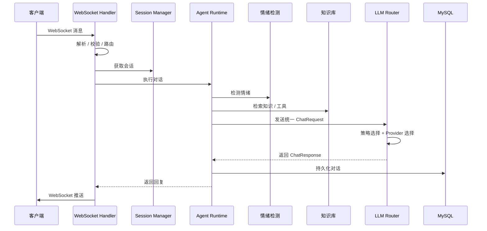
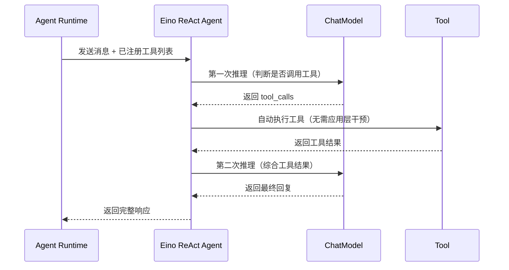

# 江南水乡智能导游系统 - 后端

基于 Go + Gin + WebSocket + LLM 的智能导游后端服务，支持**多模型路由**、**策略化调度**和**容错**。

## 技术栈

- **Go 1.25** — 编程语言
- **Gin** — HTTP 框架
- **Gorilla WebSocket** — WebSocket 支持
- **MySQL 8.0** — 数据库
- **Eino (CloudWeGo)** — LLM 框架，统一模型调用
- **Eino ReAct Agent** — 内置 ReAct 推理循环，自动工具调用
- **Eino OpenAI ChatModel** — 通过 OpenAI 兼容接口接入所有模型
- **Eino Callbacks** — 可观测性回调机制（trace/audit/logs）
- **Prometheus** — 指标监控
- **OpenTelemetry** — 分布式追踪

## 项目结构

```
backend/
├── cmd/server/              # 程序入口
├── internal/
│   ├── config/              # 配置管理
│   ├── server/              # HTTP 服务器
│   ├── websocket/           # WebSocket 处理
│   ├── agent/               # Agent 运行时
│   ├── llm/                 # ★ 多模型路由系统（基于 Eino）
│   │   ├── adapter.go          # Adapter 接口定义
│   │   ├── eino_agent_adapter.go  # ★ EinoAgentAdapter 实现
│   │   └── fallback_adapter.go     # 兜底适配器
│   ├── cost/                # 成本优化
│   ├── emotion/             # 情绪检测
│   ├── database/            # 数据库层
│   ├── knowledge/           # 知识库
│   └── observability/       # 可观测性
├── pkg/                     # 工具包
├── examples/                # 使用示例
├── docs/                    # 详细文档
│   ├── MULTI_MODEL_ROUTER.md
│   ├── MEMORY_SYSTEM.md
│   └ OBSERVABILITY.md
├── configs/                 # 配置文件
├── MODEL_CONFIG.md          # 多模型配置说明
└── README.md                # 本文档
```

## 核心架构（基于 Eino ReAct Agent）

```
┌──────────────────────────────────────────────────┐
│         Application (agent.Runtime)               │
└────────────────────────┬─────────────────────────┘
                         │ llm.Adapter 接口
                         ▼
              ┌──────────────────────┐
              │  EinoAgentAdapter     │ ← Eino Agent 适配层
              │  (工具调用循环处理)   │
              └──────────┬───────────┘
                         │ eino_schema.Message
                         ▼
              ┌──────────────────────┐
              │  Eino ReAct Agent    │ ← ★ 真正的 ReAct 推理 Agent
              │ ┌──────────────────┐ │
              │ │ 工具自动调用循环   │ │ ← Agent 内部自动完成
              │ │ Reason → Act     │ │   思考 → 行动 → 观察 → 响应
              │ │ → Observe →      │ │
              │ │   Respond        │ │
              │ └──────────────────┘ │
              │ ┌──────────────────┐ │
              │ │ ModelFailover    │ │ ← 故障转移
              │ │ ModelRetry       │ │ ← 重试机制
              │ └──────────────────┘ │
              └──────────┬───────────┘
                         │
              ┌──────────▼──────────┐
              │   Eino ChatModel    │ ← OpenAI 兼容接口
              │ (Claude/GPT/GLM/...) │
              └─────────────────────┘
```

## 后端请求处理流程



## Agent 设计模式

### 1. 策略模式（Strategy Pattern）

`tools.Tool` 接口统一所有可调用工具的契约。天气查询、玩家信息、游戏指南等具体工具实现同一接口，`Runtime` 运行时只依赖接口，不依赖实现，便于扩展和替换。

```go
type Tool interface {
    Name() string
    Description() string
    Execute(ctx context.Context, params map[string]interface{}) (interface{}, error)
    Timeout() time.Duration
}
```

### 2. 注册表模式（Registry Pattern）

`ToolRegistry` 集中管理所有工具，按名称注册和查找。新增工具只需实现 `Tool` 接口并在 `NewToolRegistry` 中注册，无需改动 `Runtime` 调用逻辑。

### 3. 适配器模式（Adapter Pattern）

`Runtime` 通过 `llm.Adapter` 接口调用大模型，通过 `llm.Adapter` 兜底适配器处理失败场景。底层可以对接 Claude、OpenAI 或 Fallback，上层代码无需感知具体 Provider。

### 4. 依赖注入（Dependency Injection）

`Runtime` 的所有依赖（LLM 适配器、工具注册表、会话管理器、成本优化器、情绪检测器）都通过 `NewRuntime` 构造函数注入，方便单元测试、Mock 和替换实现。

### 5. ReAct / 工具调用循环（Eino 内置）

系统使用 **Eino ReAct Agent** 实现完整的 ReAct 推理循环，工具调用完全由 Agent 内部自动处理：

1. **Reason**：Agent 内部调用 ChatModel，判断是否需要调用工具
2. **Act**：如果检测到 tool_calls，Agent 自动查找并执行注册的工具
3. **Observe**：工具执行结果自动注入对话上下文
4. **Respond**：循环直到生成最终自然语言回复



**关键变化**：
- ✅ **工具自动执行**：ReAct Agent 内部完成工具调用循环，应用层无需手动解析 tool_calls
- ✅ **统一接口**：`agent.Generate()` / `agent.Stream()` 直接返回最终结果
- ✅ **回调追踪**：通过 Eino Callbacks 机制实现模型调用和工具调用的 trace 与审计日志

## 架构设计亮点

### 1. 为什么迁移到 Eino ReAct Agent？

| 维度 | Eino ReAct Agent | 自研 ReAct（旧方案） |
|------|-----------------|-------------------|
| **维护成本** | 框架维护，跟随社区更新 | 自行维护 ReAct 循环逻辑 |
| **抽象层级** | 统一 `ChatModel` 接口 + `react.Agent` | 自定义 `Provider` + 手动工具调用 |
| **工具调用** | Agent 内部自动完成 Reason→Act→Observe→Respond | 应用层手动解析 tool_calls、执行工具、注入结果 |
| **故障转移** | 内置 `ModelFailoverConfig` | 手动实现降级链 |
| **重试机制** | 内置 `ModelRetryConfig` | 手动实现重试逻辑 |
| **流式处理** | 自动处理 SSE 流，支持流式 ReAct | 手动解析 SSE 数据 |
| **Tool Calling** | 统一工具注册，自动匹配执行 | 各 Provider 不同实现 |
| **可观测性** | 内置 Callbacks 机制，支持 trace/audit | 应用层手动埋点 |
| **扩展性** | 通过 OpenAI 兼容接口接入任意模型 | 需为每个 Provider 写适配器 |

**迁移收益**：
- **减少代码量**：移除了大量手动处理工具调用的代码（`runWithToolLoop`、`runStreamWithToolLoop` 等）
- **工具自动执行**：ReAct Agent 内部自动完成"思考→调用工具→获取结果→继续思考"的完整循环
- **统一抽象**：所有模型通过同一 OpenAI 兼容接口接入
- **内置可靠性**：Eino 提供故障转移和重试机制
- **回调追踪**：通过 `callbacks.Handler` 实现模型调用和工具调用的 trace 与审计日志
- **简化配置**：不需要区分 Provider 类型（`type` 字段已删除）

### 2. EMA 算法在路由中的作用

```
newEMA = 0.3 × currentSample + 0.7 × previousEMA
Score  = Latency + ErrorRate × 10000
```

- 30% 新数据权重保证快速响应模型状态变化。
- 70% 历史权重保证不会因为一次抖动就改变决策。
- 错误率放大 10000 倍，确保高错误模型被快速降级。

### 3. Eino ModelFailover 如何保证高可用？

```
主模型 → ShouldFailover判断 → GetFailoverModel选择 → 下一个模型 → 最终兜底回复
```

- **自动降级**：Eino 检测失败后自动切换到下一个模型
- **流式降级**：流式失败且无内容时，降级为非流式调用（同模型）
- **配置简化**：通过 `ModelFailoverConfig.MaxRetries` 控制最大重试次数
- **兜底回复**：所有模型失败时返回 FallbackAdapter 预设回复

### 4. 成本控制手段

| 手段 | 说明 |
|------|------|
| 相似问题缓存 | 命中缓存直接返回，减少 API 调用 |
| 历史消息摘要 | 长对话自动压缩，减少 token 消耗 |
| Token 估算 | 本地估算，无需调用即可预估成本 |
| Cost 策略 | 自动选择单价最低的模型 |

### 5. 缓存方案（业界最佳实践）

#### 缓存架构

本项目采用多层缓存架构，结合了业界最佳实践：

```
┌─────────────────────────────────────────────────────────────┐
│                    客户端请求                               │
└────────────────────────────────┬────────────────────────────┘
                                 │
                                 ▼
┌─────────────────────────────────────────────────────────────┐
│  第一层：精确匹配缓存 (Exact Match)                        │
│  • 使用 SHA256 哈希生成唯一缓存键                          │
│  • 缓存键格式：hash(question + ":" + model)              │
│  • 适用于完全相同的重复请求                                │
└────────────────────────────────┬────────────────────────────┘
                                 │ 未命中
                                 ▼
┌─────────────────────────────────────────────────────────────┐
│  第二层：语义缓存 (Semantic Cache)                         │
│  • 使用 Embedding 将问题转换为向量                         │
│  • 计算余弦相似度匹配相似问题                              │
│  • 相似度阈值可配置（默认 0.85）                          │
│  • 适用于提问方式不同但意图相同的请求                      │
└────────────────────────────────┬────────────────────────────┘
                                 │ 未命中
                                 ▼
┌─────────────────────────────────────────────────────────────┐
│  第三层：工具结果缓存 (Tool Result Cache)                  │
│  • 缓存外部 API 调用结果                                  │
│  • 缓存键格式：hash(tool_name + ":" + params)            │
│  • 适用于天气查询、数据库查询等外部调用                    │
└────────────────────────────────┬────────────────────────────┘
                                 │ 未命中
                                 ▼
┌─────────────────────────────────────────────────────────────┐
│  第四层：对话摘要缓存 (Summary Cache)                      │
│  • 使用 LLM 将长对话压缩为摘要                            │
│  • 增量更新，保持上下文                                    │
│  • 减少历史消息的 token 消耗                              │
└────────────────────────────────┬────────────────────────────┘
                                 │
                                 ▼
                          LLM API 调用
```

#### 缓存配置

```yaml
cache:
  enabled: true           # 是否启用缓存
  ttl: 1h                # 缓存过期时间
  max_entries: 1000      # 最大缓存条目数
  similarity_threshold: 0.85  # 语义相似度阈值
```

#### 缓存类型对比

| 缓存类型 | 哈希函数 | 适用场景 | 优缺点 |
|---------|---------|---------|-------|
| **精确匹配** | SHA256(question:model) | 重复请求、批量处理 | 简单高效，O(1) 查询，但无法处理语义相似 |
| **语义缓存** | Embedding 向量 + 余弦相似度 | 相似问题、意图理解 | 智能匹配，但计算成本较高 |
| **工具结果** | SHA256(tool_name:params) | 外部 API 调用、数据库查询 | 节省外部调用成本，需处理数据时效性 |
| **对话摘要** | LLM 生成 | 长对话上下文管理 | 减少 token 消耗，可能丢失细节 |

#### 缓存统计指标

系统提供完整的缓存统计：

| 指标 | 说明 |
|------|------|
| Hits | 缓存命中次数 |
| Misses | 缓存未命中次数 |
| HitRate | 缓存命中率 (%) |
| Entries | 当前缓存条目数 |
| MemoryUsageKB | 内存使用量 (KB) |

#### 业界最佳实践总结

1. **多层缓存架构**：依次使用精确匹配 → 语义匹配 → 工具结果 → 对话摘要，层层降级
2. **缓存失效策略**：TTL 自动过期 + LRU 淘汰（容量限制时）
3. **哈希函数选择**：使用 SHA256 而非简单哈希，避免碰撞
4. **语义相似度阈值**：建议设置在 0.8-0.9 之间，平衡准确性和召回率
5. **异步构建语义索引**：避免阻塞主流程
6. **监控与告警**：跟踪缓存命中率，低于阈值时告警

---

## 快速开始

### 环境要求

- Go 1.25+
- MySQL 8.0+
- 至少一个 LLM API Key（Claude / OpenAI / 兼容 OpenAI 格式的 API）

### 配置文件

项目提供两份配置文件，分别用于不同环境：

| 文件 | 用途 | Trace 输出 | Prometheus |
|------|------|-----------|------------|
| `configs/config-local.yaml` | 本地开发 | stdout（控制台） | 关闭 |
| `configs/config-docker.yaml` | Docker 部署 | otlp（Jaeger） | 启用 |

### 方式一：本地开发

1. **配置环境变量**：
```bash
# 复制环境变量模板
cp .env.example .env

# 编辑 .env 文件，填入你的 API Key
```

2. **启动服务**：
```bash
cd backend
go mod download
go run cmd/server/main.go
```

服务将在 `http://localhost:8080` 启动。

### 方式二：Docker 一键部署

**推荐用于生产环境或快速体验**，包含完整的监控链路：

1. **设置环境变量**（可选）：
```bash
# Linux/Mac
export CLAUDE_API_KEY="your-claude-api-key"

# Windows PowerShell
$env:CLAUDE_API_KEY="your-claude-api-key"
```
注意：使用新的模型，需要在 `configs/config-docker.yaml` 中添加对应的模型配置，并移除不需要的模型配置。

```yaml
# configs/config-docker.yaml
models:
  - name: "claude-3.5"
    api_key: ${CLAUDE_API_KEY}
    base_url: "https://www.anthropic.com/claude-code"
```

2. **一键启动**：

```bash
# Linux/Mac
./start.sh

# Windows PowerShell
.\start.ps1

# 或手动启动
docker-compose up -d
```

3. **访问地址**：

| 服务 | 地址 | 说明 |
|------|------|------|
| 前端页面 | http://localhost:3000 | 游戏界面 |
| 后端 API | http://localhost:8080 | REST API |
| Prometheus | http://localhost:9090 | 指标监控 |
| Jaeger UI | http://localhost:16686 | 分布式追踪 |
| MySQL | localhost:3306 | 数据库 |

4. **停止服务**：
```bash
docker-compose down
```

### Docker 环境架构

```
┌──────────────────────────────────────────────────────────────┐
│                     Docker Compose Stack                      │
├────────────┬────────────┬────────────┬───────────────────────┤
│   MySQL    │  Jaeger    │ Prometheus │         Nginx         │
│  (3306)   │  (16686)   │   (9090)   │       (3000)          │
│           │  (4318)    │            │                       │
└─────┬─────┴─────┬───────┴─────┬──────┴──────────┬──────────┘
      │           │             │                 │
      └───────────┼─────────────┼─────────────────┘
                  ▼             ▼
            ┌─────────────────────────────┐
            │         Backend (8080)      │
            │  • LLM 多模型路由           │
            │  • WebSocket 实时通信       │
            │  • OpenTelemetry 追踪       │
            │  • Prometheus 指标          │
            └─────────────────────────────┘
```

### 环境变量参考

| 变量名 | 说明 | 默认值 |
|--------|------|--------|
| `CONFIG_FILE` | 配置文件路径 | `configs/config.yaml` |
| `DB_HOST` | 数据库主机 | `localhost` / `mysql`（Docker） |
| `DB_PORT` | 数据库端口 | `3306` |
| `DB_USER` | 数据库用户名 | `root` / `water_town`（Docker） |
| `DB_PASS` | 数据库密码 | `password123` |
| `GLM_API_KEY` | GLM API Key | - |
| `MIMO_API_KEY` | MIMO/Claude API Key | - |
| `BAILIAN_API_KEY` | 阿里云通义千问 API Key | - |
| `OBSERVABILITY_ENABLED` | 启用追踪 | `true` |
| `OBSERVABILITY_TRACER_EXPORTER` | 追踪输出 | `stdout` / `otlp` |
| `OBSERVABILITY_ENDPOINT` | OTLP 端点 | `http://localhost:4318` / `http://jaeger:4318` |

## 多模型路由（核心亮点）

### 路由策略

系统支持 6 种路由策略，可根据场景灵活切换：

| 策略 | 说明 | 适用场景 |
|------|------|---------|
| **Fixed** | 固定使用指定模型 | 开发调试 |
| **Cost** | 选择成本最低的模型 | 成本控制 |
| **Latency** | 选择延迟最低的模型（EMA 跟踪） | 实时对话 |
| **Capability** | 根据任务类型选模型 | 混合场景 |
| **Fallback** | 按降级链依次尝试 | **生产推荐** |
| **Weighted** | 按权重随机选择 | A/B 测试 |

### 降级链

```
主模型（Claude Sonnet） → 通用备选（OpenAI GPT-4o） → 低成本兜底（Haiku/GPT-4o-mini）
```

**关键设计**：降级链容忍更高错误率，确保可用性优先于成本。

### EMA（指数移动平均）统计

```
// 新样本权重 30%，历史权重 70%，平滑异常波动
newEMA = 0.3 × currentSample + 0.7 × previousEMA
```

Router 用 EMA 平滑跟踪每个 provider 的延迟和错误率，避免单次异常影响路由决策。

### 任务分类

根据消息内容自动识别任务类型，按优先级匹配最适合的模型：

```
Code (代码) > Reasoning (推理) > Chinese (中文) > LongText (长文本) > General (通用)
```

**分类规则**：
- **Code**：检测代码关键词（`function`、`class`、`def`）、代码块标记、特殊符号占比 > 30%
- **Reasoning**：检测推理类关键词（`为什么`、`how`、`why`、`分析`、`推导`）
- **Chinese**：中文字符占比 > 30%
- **LongText**：Token 估算 > 2000
- **General**：不满足以上条件的兜底分类

**2026年模型能力映射**（基于最新基准测试数据）：

| 任务类型 | 推荐 Provider（按优先级） | 推荐模型 |
|----------|-------------------------|----------|
| Code | claude → openai → glm → qwen | Claude 3.5 Sonnet、GPT-4o、GLM-4 Code、Qwen 2.0 Code |
| Reasoning | claude → openai → gemini → glm → qwen | Claude 3.5 Sonnet、GPT-4o、Gemini 1.5 Pro、GLM-4 |
| Chinese | glm → qwen → claude → openai | GLM-4、Qwen 2.0、Claude 3.5 Sonnet、GPT-4o |
| LongText | claude → gemini → qwen → glm → openai | Claude 3.5 Sonnet (200K)、Gemini 1.5 Pro (1M)、Qwen 2.0 |
| General | claude → openai → glm → qwen → gemini | Claude 3.5 Sonnet、GPT-4o、GLM-4、Qwen 2.0、Gemini 1.5 Flash |

**Token 估算**：每 4 字符约 1 token，中文按字节估算。

## 核心特性

### 1. 多 Provider 支持

- **Claude** — 使用 `anthropic-sdk-go` 原生 SDK
- **OpenAI** — 使用 `go-openai` 原生 SDK
- **兼容格式** — GLM、通义千问、DeepSeek 等支持 OpenAI 格式的 API
- 所有 Provider 均支持：普通 Chat / 流式 Chat / Tool Calling

### 2. 智能路由

- 6 种路由策略按需切换
- EMA 延迟和错误率跟踪
- 任务分类 → 模型能力映射
- 自动降级链

### 3. 成本优化

- 相似问题缓存
- 历史消息摘要
- Token 使用统计
- 成本估算（每个 Provider 可配置输入/输出单价）

### 4. 高可用

- Eino ModelFailover 故障转移机制
- Eino ModelRetry 重试策略（指数退避 + 抖动）
- 多模型降级链
- 自动重试
- 兜底适配器（FallbackAdapter）

### 5. 多租户

- 租户隔离
- 独立资源池
- 审计日志

## 配置示例

### 基础配置（兼容旧模式）

```yaml
llm:
  models:
    - name: claude-sonnet-4-20250514
      base_url: ""
      api_key: ${ANTHROPIC_API_KEY}
      enabled: true
      max_tokens: 2000
      temperature: 0.7

    - name: gpt-4o
      base_url: ""
      api_key: ${OPENAI_API_KEY}
      enabled: true
      max_tokens: 2000
      temperature: 0.7

    - name: glm-4-flash
      base_url: https://open.bigmodel.cn/api/paas/v4/chat/completions
      api_key: ${GLM_API_KEY}
      enabled: true
      max_tokens: 300
      temperature: 0.7

  timeout: 10s
  max_retries: 3
  retry_delay: 1s
  auto_switch: true  # 启用降级链自动切换
```

系统会根据模型名称自动推断 Provider 类型：
- 名称含 `claude` → Claude Provider
- 名称含 `gpt`/`o1`/`o3` → OpenAI Provider
- 其他 → OpenAI 兼容模式（GLM、Qwen 等均支持）

### 高级配置（代码级）

```go
// 从配置创建 EinoAgentAdapter
adapter := llm.NewRouterFromConfig(cfg.LLM, logger)

// 设置工具执行器（用于工具调用）
if agentAdapter, ok := adapter.(*llm.EinoAgentAdapter); ok {
    agentAdapter.SetToolExecutor(toolRegistry.Execute)
}

// 设置路由策略
adapter.SetStrategy(llm.StrategyFallback)
```

详细示例见 [`examples/multi_model_example.go`](examples/multi_model_example.go)。

## 可观测性

项目提供完整的 **Metrics + Traces + Logs + LLM 专项可观测** 能力：

### 核心功能

| 功能 | 说明 | 配置开关 |
|------|------|---------|
| **Prometheus 指标** | HTTP/LLM/WebSocket/缓存指标 | `observability.prometheus` |
| **OpenTelemetry 追踪** | 分布式链路追踪 | `observability.enabled` |
| **Langfuse LLM 追踪** | LLM 调用详情（输入/输出/Token/成本） | `observability.langfuse.enabled` |
| **审计日志** | 操作记录 | 默认启用 |

### 配置示例

```yaml
observability:
  enabled: true                   # Tracing 总开关
  prometheus: true                # Prometheus 指标开关
  trace_exporter: stdout          # stdout（开发）| otlp（生产）
  
  langfuse:
    enabled: false                # Langfuse LLM 专项追踪
    host: https://cloud.langfuse.com
```

### 快速查看

- **指标**：访问 `http://localhost:8080/metrics`
- **Trace**：配置 `trace_exporter: stdout` 后查看日志
- **Langfuse**：启用后访问 [cloud.langfuse.com](https://cloud.langfuse.com)

详细说明请查看 [可观测性指南](docs/OBSERVABILITY.md)。

---

## 详细文档

- [多模型路由系统](docs/MULTI_MODEL_ROUTER.md) — 完整架构说明
- [多模型配置](MODEL_CONFIG.md) — 配置参数详解
- [可观测性指南](docs/OBSERVABILITY.md) — Prometheus + OpenTelemetry + Langfuse 使用说明
- [缓存系统设计](docs/CACHE_SYSTEM.md) — 多层缓存架构（精确匹配 + 语义匹配）

## API 文档

### WebSocket 连接

**URL:** `ws://localhost:8080/ws/game`

**消息格式:**
```json
{
  "type": "MESSAGE_TYPE",
  "requestId": "req_001",
  "tenantId": "tenant_001",
  "timestamp": 1718457600000,
  "payload": { ... }
}
```

### REST API

```
GET /health              # 健康检查
GET /metrics             # Prometheus 指标
GET /api/v1/audit        # 审计日志
```

## 开发

### 添加新 Provider

实现 `model.Provider` 接口即可：

```go
type Provider interface {
    Name() string
    AvailableModels() []string
    Chat(ctx context.Context, req *ChatRequest) (*ChatResponse, error)
    StreamChat(ctx context.Context, req *ChatRequest) (<-chan StreamChunk, error)
    InputPricePer1K() float64
    OutputPricePer1K() float64
    MaxContextLength() int
}
```

### 添加新工具

```go
type MyTool struct{}

func (t *MyTool) Name() string     { return "my_tool" }
func (t *MyTool) Description() string { return "工具描述" }
func (t *MyTool) Timeout() time.Duration { return 5 * time.Second }

func (t *MyTool) Execute(ctx context.Context, params map[string]interface{}) (interface{}, error) {
    return result, nil
}
```

## 依赖

核心第三方依赖（仅 2 个 SDK）：
- `github.com/anthropics/anthropic-sdk-go` — Claude 原生 SDK
- `github.com/sashabaranov/go-openai` — OpenAI 原生 SDK

**不使用 LangChain**，以标准库为主，保持轻量。

## 许可证

MIT
