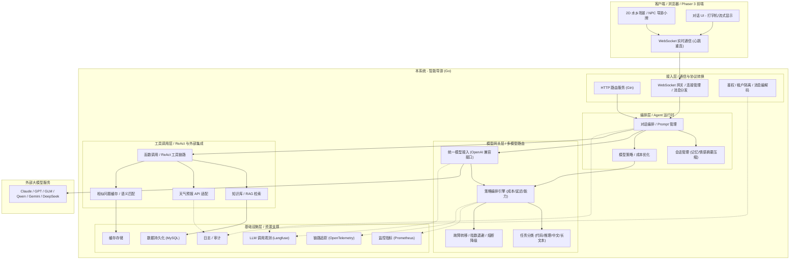
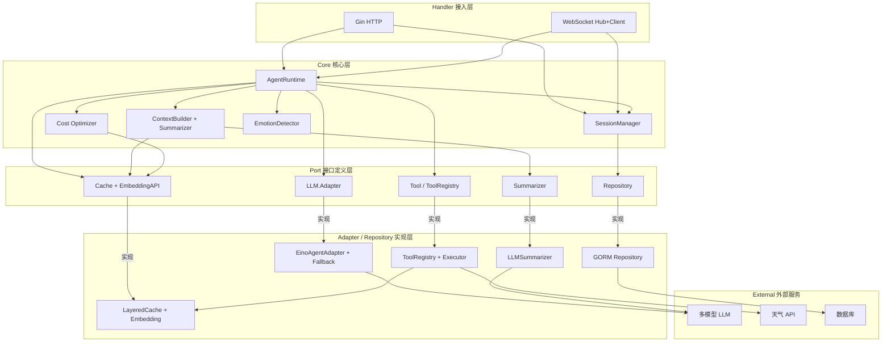
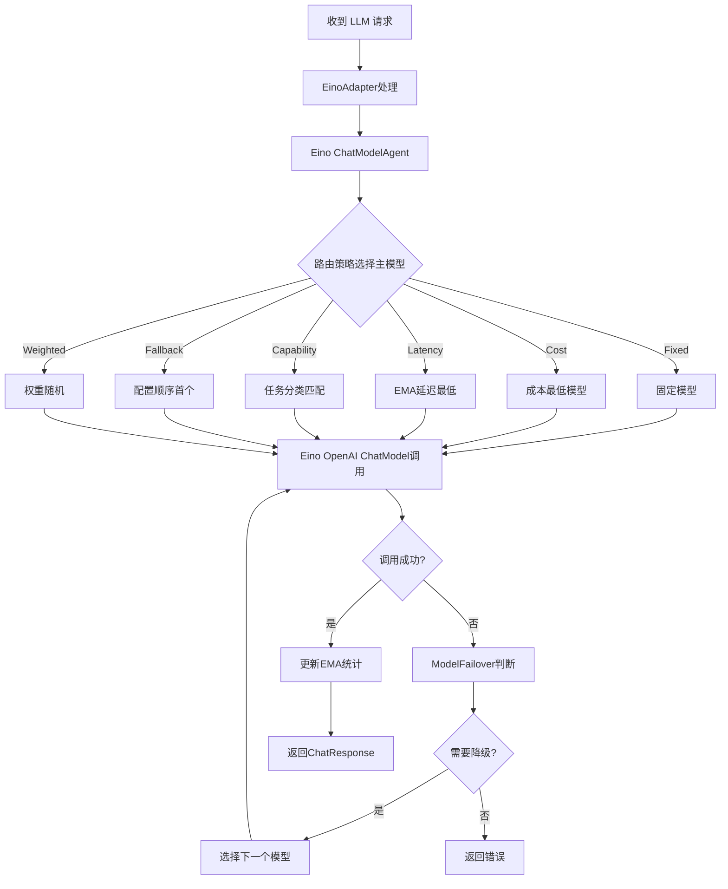
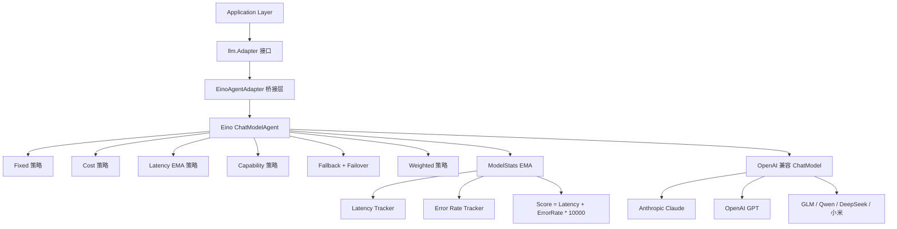
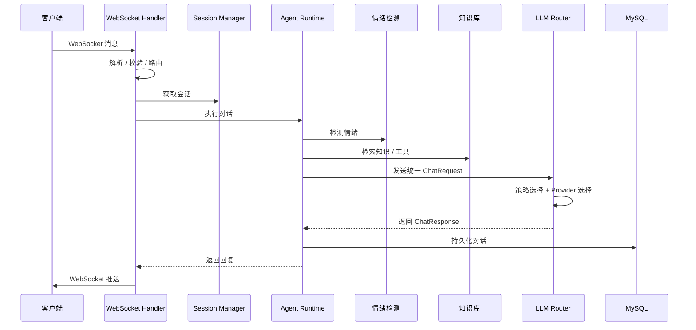
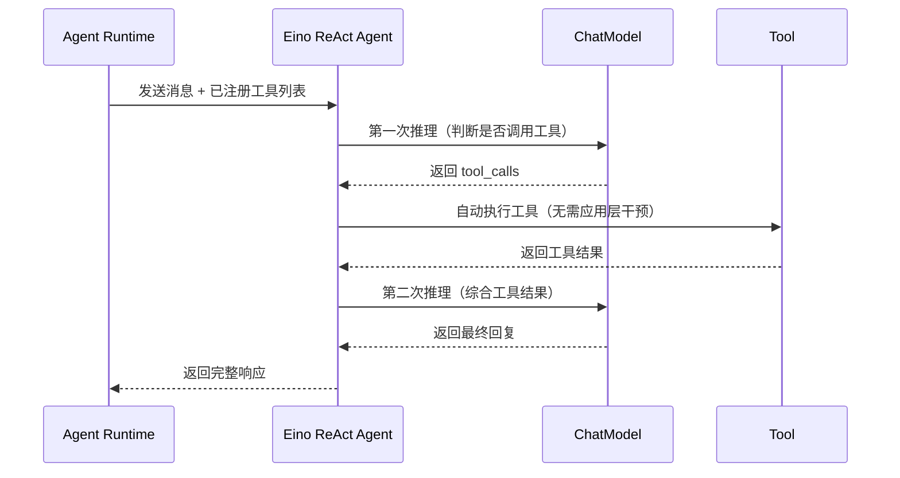
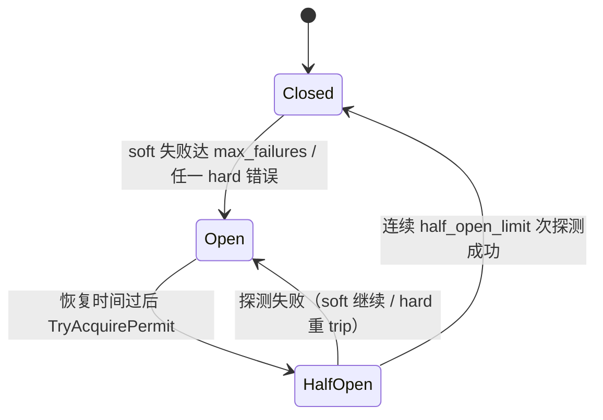

# 江南水乡智能导游系统 - 后端

基于 Go + Gin + WebSocket + LLM 的智能导游后端服务，支持**多模型路由**、**策略化调度**和**容错**。

## 技术栈

- **Go 1.25** — 编程语言
- **Gin** — HTTP 框架
- **Gorilla WebSocket** — WebSocket 支持
- **MySQL 8.0** — 数据库
- **Eino (CloudWeGo)** — LLM 框架，统一模型调用
- **Eino ReAct Agent** — 内置 ReAct 推理循环，自动工具调用
- **Eino OpenAI ChatModel** — 通过 OpenAI 兼容接口接入所有模型
- **Eino Callbacks** — 可观测性回调机制（trace/audit/logs）
- **Prometheus** — 指标监控
- **OpenTelemetry** — 分布式追踪

### 后端架构图

**系统全景架构图**（自顶向下：客户端 → 接入层 → 编排层 → 模型网关层 → 工具调用层 → 基础设施层 → 外部大模型服务）：


```mermaid
graph TB

    subgraph Client["客户端 / 浏览器 / Phaser 3 前端"]
        K1["2D 水乡场景 / NPC 导游小牌"]
        K2["对话 UI - 打字机/流式显示"]
        K3["WebSocket 实时通信 (心跳重连)"]
    end

    subgraph Sys["本系统 - 智能导游 (Go)"]
        subgraph LA["接入层 / 通信与协议转换"]
            A1["HTTP 路由服务 (Gin)"]
            A2["WebSocket 网关 / 连接管理 / 消息分发"]
            A3["鉴权 / 租户隔离 / 消息编解码"]
        end

        subgraph LB["编排层 / Agent 运行时"]
            B1["对话编排 / Prompt 管理"]
            B2["会话管理 (记忆/情感摘要压缩)"]
            B3["模型策略 / 成本优化"]
        end

        subgraph LC["模型网关层 / 多模型路由"]
            C1["统一模型接入 (OpenAI 兼容接口)"]
            C2["策略编排引擎 (成本/延迟/能力)"]
            C3["任务分类 (代码/推理/中文/长文本)"]
            C4["故障转移 / 指数退避 / 熔断降级"]
        end

        subgraph LD["工具调用层 / ReAct 与外部集成"]
            D1["函数调用 / ReAct 工具链路"]
            D2["知识库 / RAG 检索"]
            D3["天气预报 API 适配"]
            D4["相似问题缓存 / 语义匹配"]
        end

        subgraph LE["基础设施层 / 资源支撑"]
            E1["监控指标 (Prometheus)"]
            E2["链路追踪 (OpenTelemetry)"]
            E3["LLM 调用观测 (Langfuse)"]
            E4["数据持久化 (MySQL)"]
            E5["缓存存储"]
            E6["日志 / 审计"]
        end
    end

    subgraph Ext["外部大模型服务"]
        X1["Claude / GPT / GLM / Qwen / Gemini / DeepSeek"]
    end

    %% 客户端：UI 依赖 WebSocket 通道，经其连到接入层网关
    K1 --> K3
    K2 --> K3
    K3 --> A2

    %% 接入层 → 编排层：请求统一汇入对话编排
    A1 --> B1
    A2 --> B1

    %% 编排层内部协作
    B1 --> B2
    B1 --> B3

    %% 编排层 → 模型网关层：编排发起模型调用，策略层对接编排引擎
    B1 --> C1
    B3 --> C2

    %% 模型网关层内部流转：统一接入 → 策略引擎 → 任务分类 / 故障转移
    C1 --> C2
    C2 --> C3
    C2 --> C4

    %% 模型网关 → 外部大模型服务
    C1 --> X1

    %% 编排层 → 工具调用层：ReAct 循环发起函数调用
    B1 --> D1

    %% 工具调用层内部流转
    D1 --> D2
    D1 --> D3
    D1 --> D4

    %% 工具调用层 → 基础设施层（实线 = 数据读写）
    D2 --> E4
    D4 --> E5

    %% 观测与审计（虚线 = 旁路观测，不参与主链路）
    A3 -.-> E6
    C2 -.-> E1
    C2 -.-> E2
    C1 -.-> E3
    B1 -.-> E3
    D3 -.-> E6
```

> 本图为**概念分层**（与目录不是 1:1）。实际 Go 包目录映射：Handler = `internal/handler/*`、Core = `internal/core/*`、Adapter/Repository 接口实现 = `internal/adapter/*` + `internal/repository/*`。完整路径对照见文末「**重构路径映射总表**」。


```mermaid
graph TB

    subgraph L1["Handler 接入层"]
        H1["Gin HTTP"]
        H2["WebSocket Hub+Client"]
    end

    subgraph L2["Core 核心层"]
        C1["AgentRuntime"]
        C2["ContextBuilder + Summarizer"]
        C3["SessionManager"]
        C4["Cost Optimizer"]
        C5["EmotionDetector"]
    end

    subgraph L3["Port 接口定义层"]
        I1["LLM.Adapter"]
        I2["Cache + EmbeddingAPI"]
        I3["Summarizer"]
        I4["Tool / ToolRegistry"]
        I6["Repository"]
    end

    subgraph L4["Adapter / Repository 实现层"]
        F1["EinoAgentAdapter + Fallback"]
        F2["LayeredCache + Embedding"]
        F3["LLMSummarizer"]
        F4["ToolRegistry + Executor"]
        F6["GORM Repository"]
    end

    subgraph L5["External 外部服务"]
        E1["多模型 LLM"]
        E2["天气 API"]
        E3["数据库"]
    end

    %% 入站：Handler -> Core（实线箭头 = 调用依赖）
    H1 --> C1
    H1 --> C3
    H2 --> C1
    H2 --> C3

    %% Core 内部协作
    C1 --> C2
    C1 --> C3
    C1 --> C4
    C1 --> C5

    %% Core -> Port 接口（实线 = 依赖接口）
    C1 --> I1
    C1 --> I2
    C1 --> I4
    C2 --> I2
    C2 --> I3
    C3 --> I6
    C4 --> I2

    %% Port 接口 <- Adapter / Repository（带"实现"标签 = 依赖倒置）
    I1 -- 实现 --> F1
    I2 -- 实现 --> F2
    I3 -- 实现 --> F3
    I4 -- 实现 --> F4
    I6 -- 实现 --> F6

    %% Adapter -> 外部服务（所有出站 IO）
    F1 --> E1
    F3 --> E1
    F4 --> E2
    F4 --> F2
    F6 --> E3
```

> **节点对应代码路径**（上面图里故意不写路径，避免渲染器对特殊字符的解析问题）：
>
> - H1 = `handler/http/gin.go` ｜ H2 = `handler/ws/manager.go` + `handler/ws/client.go`
> - C1 = `core/agent/agent.go` ｜ C2 = `core/agent/*` + `core/context/summarizer.go` ｜ C3 = `core/session/manager.go` ｜ C4 = `core/cost/optimizer.go` ｜ C5 = `core/emotion/detector.go`
> - I1/I2/I3/I4 接口定义分别位于 F1/F2/F3/F4 包内；I6 Repository 接口定义位于 `repository/*_repo.go` 上的 consumer 侧
> - F1 = `adapter/llm/eino_agent.go` + `fallback.go` ｜ F2 = `adapter/cache/layered.go` + `embedding.go` ｜ F3 = `core/context/summarizer.go`（概念属 Adapter，物理放在 core/context 减少跨包） ｜ F4 = `adapter/tools/*` + `adapter/weather/*` ｜ F6 = `repository/*.go`
> - E1 = 小米/通义/GLM/OpenAI/DeepSeek ｜ E2 = QWeather / Open-Meteo ｜ E3 = MySQL / SQLite
>
> 完整旧→新路径对照见文末「**重构路径映射总表**」。

***

### 多模型路由结构（基于 Eino）


```mermaid
flowchart TD
    A[收到 LLM 请求] --> B[EinoAdapter处理]
    B --> C[Eino ChatModelAgent]
    C --> D{路由策略选择主模型}
    D -->|Fixed| E[固定模型]
    D -->|Cost| F[成本最低模型]
    D -->|Latency| G[EMA延迟最低]
    D -->|Capability| H[任务分类匹配]
    D -->|Fallback| I[配置顺序首个]
    D -->|Weighted| J[权重随机]
    E --> K[Eino OpenAI ChatModel调用]
    F --> K
    G --> K
    H --> K
    I --> K
    J --> K
    K --> L{调用成功?}
    L -->|是| M[更新EMA统计]
    L -->|否| N[ModelFailover判断]
    N --> O{需要降级?}
    O -->|是| P[选择下一个模型]
    O -->|否| Q[返回错误]
    P --> K
    M --> R[返回ChatResponse]
```


```mermaid
graph TB
    A["Application Layer"] --> B["llm.Adapter 接口"]
    B --> C["EinoAgentAdapter 桥接层"]
    C --> D["Eino ChatModelAgent"]
    D --> E["Fixed 策略"]
    D --> F["Cost 策略"]
    D --> G["Latency EMA 策略"]
    D --> H["Capability 策略"]
    D --> I["Fallback + Failover"]
    D --> J["Weighted 策略"]
    D --> K["ModelStats EMA"]
    K --> L["Latency Tracker"]
    K --> M["Error Rate Tracker"]
    K --> N["Score = Latency + ErrorRate * 10000"]
    D --> O["OpenAI 兼容 ChatModel"]
    O --> P["Anthropic Claude"]
    O --> Q["OpenAI GPT"]
    O --> R["GLM / Qwen / DeepSeek / 小米"]
```

> 对应代码：
>
> - A = `core/agent.Runtime` + `handler/ws` + `handler/http`
> - B = `internal/adapter/llm/adapter.go` ｜ C = `adapter/llm/eino_agent.go`
> - D～N = 全部由 Eino ChatModelAgent 内置实现（无需本项目代码维护路由策略）
> - O～R = 通过 Eino OpenAI 兼容 ChatModel 接入各大模型

## 项目结构

后端采用**清洁架构（Clean Architecture）**分层，依赖方向**始终向内**：接入层 → 核心层 ← 适配层。

```
backend/
├── cmd/server/              # 程序入口（最小化，仅 DI 组装 + 启动）
├── internal/
│   ├── adapter/             # ★ 外部依赖适配层（所有 IO 边界在这一层）
│   │   ├── cache/           #   分层缓存 LayeredCache + Embedding 客户端
│   │   ├── knowledge/       #   知识库 JSON 加载 + FindQuestion/FindByTag
│   │   ├── llm/             #   LLM 适配（EinoAgentAdapter + FallbackAdapter 兜底）
│   │   │   ├── adapter.go       # llm.Adapter 接口 + Message 定义
│   │   │   ├── eino_agent.go    # ★ Eino ReAct Agent 桥接实现
│   │   │   └── fallback.go      # 兜底预设回复（无 API Key 也能演示）
│   │   ├── tools/           #   Tool 接口 + ToolRegistry + 天气/游戏/RAG 工具
│   │   └── weather/         #   天气 API 适配（QWeather / Open-Meteo）
│   ├── core/                # ★ 业务核心层（纯 Go 逻辑、无 IO、可单独测试）
│   │   ├── agent/           #   Agent Runtime + Prompts（对话编排核心）
│   │   ├── context/         #   上下文构建 + LLMSummarizer 增量摘要
│   │   ├── cost/            #   Optimizer 成本优化（相似缓存 + 历史摘要 + Token 估算）
│   │   ├── emotion/         #   规则情绪检测（关键词 + 表情符号识别）
│   │   └── session/         #   SessionManager 会话生命周期 + 消息栈
│   ├── handler/             # ★ 接入层（协议与传输、无业务逻辑）
│   │   ├── http/            #   Gin HTTP 路由（健康检查、审计、WS 升级）
│   │   └── ws/              #   WebSocket Hub + Client 连接池 + 消息协议
│   ├── repository/          # ★ 数据持久层（GORM 实现，接口由核心层消费）
│   │   ├── db.go            #   数据库初始化 + 自动迁移
│   │   ├── model.go         #   Player / Conversation / Audit 实体模型
│   │   ├── player.go        #   玩家仓储
│   │   ├── conversation.go  #   会话记录仓储
│   │   └── audit.go         #   审计日志仓储
│   ├── config/              # 配置管理（YAML + 环境变量覆盖 + 常量校验）
│   └── observability/       # 可观测性（Prometheus 指标 + OTel 追踪 + 中间件）
├── pkg/                     # 通用工具包（可供外部项目引用）
│   ├── contextutil/         #   context 扩展（SessionID 读写）
│   ├── logging/             #   结构化日志（Zap 封装，Console + File 双输出）
│   └── utils/               #   重试、超时、Panic 恢复（支持 Logger 注入）
├── docs/                    # 后端专题文档
│   ├── MULTI_MODEL_ROUTER.md
│   ├── MEMORY_SYSTEM.md
│   ├── CACHE_SYSTEM.md
│   └── OBSERVABILITY.md
├── configs/                 # 配置文件
│   ├── config.yaml          #   本地开发配置
│   └── config-docker.yaml   #   Docker Compose 配置
├── data/                    # 运行时数据（.gitignore 忽略 db 文件本身，仅提交迁移和知识库）
│   ├── migrations/          #   SQL 初始化脚本
│   └── knowledge/           #   知识库 JSON（FAQ/游戏规则/场景描述）
├── MODEL_CONFIG.md          # 多模型配置详细说明
├── Dockerfile               # 后端镜像构建（多阶段、基于 distroless）
└── README.md                # 本文档
```

## 核心架构（基于 Eino ReAct Agent）

```
┌──────────────────────────────────────────────────┐
│         Application (agent.Runtime)               │
└────────────────────────┬─────────────────────────┘
                         │ llm.Adapter 接口
                         ▼
              ┌──────────────────────┐
              │  EinoAgentAdapter     │ ← Eino Agent 适配层
              │  (工具调用循环处理)   │
              └──────────┬───────────┘
                         │ eino_schema.Message
                         ▼
              ┌──────────────────────┐
              │  Eino ReAct Agent    │ ← ★ 真正的 ReAct 推理 Agent
              │ ┌──────────────────┐ │
              │ │ 工具自动调用循环   │ │ ← Agent 内部自动完成
              │ │ Reason → Act     │ │   思考 → 行动 → 观察 → 响应
              │ │ → Observe →      │ │
              │ │   Respond        │ │
              │ └──────────────────┘ │
              │ ┌──────────────────┐ │
              │ │ ModelFailover    │ │ ← 故障转移
              │ │ ModelRetry       │ │ ← 重试机制
              │ └──────────────────┘ │
              └──────────┬───────────┘
                         │
              ┌──────────▼──────────┐
              │   Eino ChatModel    │ ← OpenAI 兼容接口
              │ (Claude/GPT/GLM/...) │
              └─────────────────────┘
```

## 后端请求处理流程


```mermaid
sequenceDiagram
    participant C as 客户端
    participant WS as WebSocket Handler
    participant SM as Session Manager
    participant RT as Agent Runtime
    participant ED as 情绪检测
    participant KB as 知识库
    participant LLM as LLM Router
    participant DB as MySQL

    C->>WS: WebSocket 消息
    WS->>WS: 解析 / 校验 / 路由
    WS->>SM: 获取会话
    WS->>RT: 执行对话
    RT->>ED: 检测情绪
    RT->>KB: 检索知识 / 工具
    RT->>LLM: 发送统一 ChatRequest
    LLM->>LLM: 策略选择 + Provider 选择
    LLM-->>RT: 返回 ChatResponse
    RT->>DB: 持久化对话
    RT-->>WS: 返回回复
    WS->>C: WebSocket 推送
```

## Agent 设计模式

### 1. 策略模式（Strategy Pattern）

`tools.Tool` 接口统一所有可调用工具的契约。天气查询、玩家信息、游戏指南等具体工具实现同一接口，`Runtime` 运行时只依赖接口，不依赖实现，便于扩展和替换。

```go
type Tool interface {
    Name() string
    Description() string
    Execute(ctx context.Context, params map[string]interface{}) (interface{}, error)
    Timeout() time.Duration
}
```

### 2. 注册表模式（Registry Pattern）

`ToolRegistry` 集中管理所有工具，按名称注册和查找。新增工具只需实现 `Tool` 接口并在 `NewToolRegistry` 中注册，无需改动 `Runtime` 调用逻辑。

### 3. 适配器模式（Adapter Pattern）

`Runtime` 通过 `llm.Adapter` 接口调用大模型，通过 `llm.Adapter` 兜底适配器处理失败场景。底层可以对接 Claude、OpenAI 或 Fallback，上层代码无需感知具体 Provider。

### 4. 依赖注入（Dependency Injection）

`Runtime` 的所有依赖（LLM 适配器、工具注册表、会话管理器、成本优化器、情绪检测器）都通过 `NewRuntime` 构造函数注入，方便单元测试、Mock 和替换实现。

### 5. ReAct / 工具调用循环（Eino 内置）

系统使用 **Eino ReAct Agent** 实现完整的 ReAct 推理循环，工具调用完全由 Agent 内部自动处理：

1. **Reason**：Agent 内部调用 ChatModel，判断是否需要调用工具
2. **Act**：如果检测到 tool\_calls，Agent 自动查找并执行注册的工具
3. **Observe**：工具执行结果自动注入对话上下文
4. **Respond**：循环直到生成最终自然语言回复


```mermaid
sequenceDiagram
    participant RT as Agent Runtime
    participant EA as Eino ReAct Agent
    participant LLM as ChatModel
    participant T as Tool

    RT->>EA: 发送消息 + 已注册工具列表
    EA->>LLM: 第一次推理（判断是否调用工具）
    LLM-->>EA: 返回 tool_calls
    EA->>T: 自动执行工具（无需应用层干预）
    T-->>EA: 返回工具结果
    EA->>LLM: 第二次推理（综合工具结果）
    LLM-->>EA: 返回最终回复
    EA-->>RT: 返回完整响应
```

**关键变化**：

- ✅ **工具自动执行**：ReAct Agent 内部完成工具调用循环，应用层无需手动解析 tool\_calls
- ✅ **统一接口**：`agent.Generate()` / `agent.Stream()` 直接返回最终结果
- ✅ **回调追踪**：通过 Eino Callbacks 机制实现模型调用和工具调用的 trace 与审计日志

## 架构设计亮点

### 1. 为什么迁移到 Eino ReAct Agent？

| 维度               | Eino ReAct Agent                        | 自研 ReAct（旧方案）                 |
| ---------------- | --------------------------------------- | ----------------------------- |
| **维护成本**         | 框架维护，跟随社区更新                             | 自行维护 ReAct 循环逻辑               |
| **抽象层级**         | 统一 `ChatModel` 接口 + `react.Agent`       | 自定义 `Provider` + 手动工具调用       |
| **工具调用**         | Agent 内部自动完成 Reason→Act→Observe→Respond | 应用层手动解析 tool\_calls、执行工具、注入结果 |
| **故障转移**         | 内置 `ModelFailoverConfig`                | 手动实现降级链                       |
| **重试机制**         | 内置 `ModelRetryConfig`                   | 手动实现重试逻辑                      |
| **流式处理**         | 自动处理 SSE 流，支持流式 ReAct                   | 手动解析 SSE 数据                   |
| **Tool Calling** | 统一工具注册，自动匹配执行                           | 各 Provider 不同实现               |
| **可观测性**         | 内置 Callbacks 机制，支持 trace/audit          | 应用层手动埋点                       |
| **扩展性**          | 通过 OpenAI 兼容接口接入任意模型                    | 需为每个 Provider 写适配器            |

**迁移收益**：

- **减少代码量**：移除了大量手动处理工具调用的代码（`runWithToolLoop`、`runStreamWithToolLoop` 等）
- **工具自动执行**：ReAct Agent 内部自动完成"思考→调用工具→获取结果→继续思考"的完整循环
- **统一抽象**：所有模型通过同一 OpenAI 兼容接口接入
- **内置可靠性**：Eino 提供故障转移和重试机制
- **回调追踪**：通过 `callbacks.Handler` 实现模型调用和工具调用的 trace 与审计日志
- **简化配置**：不需要区分 Provider 类型（`type` 字段已删除）

### 2. EMA 算法在路由中的作用

```
newEMA = 0.3 × currentSample + 0.7 × previousEMA
Score  = Latency + ErrorRate × 10000
```

- 30% 新数据权重保证快速响应模型状态变化。
- 70% 历史权重保证不会因为一次抖动就改变决策。
- 错误率放大 10000 倍，确保高错误模型被快速降级。

### 3. Eino ModelFailover 如何保证高可用？

```
主模型 → ShouldFailover判断 → GetFailoverModel选择 → 下一个模型 → 最终兜底回复
```

- **自动降级**：Eino 检测失败后自动切换到下一个模型
- **流式降级**：流式失败且无内容时，降级为非流式调用（同模型）
- **配置简化**：通过 `ModelFailoverConfig.MaxRetries` 控制最大重试次数
- **兜底回复**：所有模型失败时返回 FallbackAdapter 预设回复

### 4. 成本控制手段

| 手段       | 说明                  |
| -------- | ------------------- |
| 相似问题缓存   | 命中缓存直接返回，减少 API 调用  |
| 历史消息摘要   | 长对话自动压缩，减少 token 消耗 |
| Token 估算 | 本地估算，无需调用即可预估成本     |
| Cost 策略  | 自动选择单价最低的模型         |

### 5. 缓存方案（业界最佳实践）

#### 缓存架构

本项目采用多层缓存架构，结合了业界最佳实践：

```
┌─────────────────────────────────────────────────────────────┐
│                    客户端请求                               │
└────────────────────────────────┬────────────────────────────┘
                                 │
                                 ▼
┌─────────────────────────────────────────────────────────────┐
│  第一层：精确匹配缓存 (Exact Match)                        │
│  • 使用 SHA256 哈希生成唯一缓存键                          │
│  • 缓存键格式：hash(question + ":" + model)              │
│  • 适用于完全相同的重复请求                                │
└────────────────────────────────┬────────────────────────────┘
                                 │ 未命中
                                 ▼
┌─────────────────────────────────────────────────────────────┐
│  第二层：语义缓存 (Semantic Cache)                         │
│  • 使用 Embedding 将问题转换为向量                         │
│  • 计算余弦相似度匹配相似问题                              │
│  • 相似度阈值可配置（默认 0.85）                          │
│  • 适用于提问方式不同但意图相同的请求                      │
└────────────────────────────────┬────────────────────────────┘
                                 │ 未命中
                                 ▼
┌─────────────────────────────────────────────────────────────┐
│  第三层：工具结果缓存 (Tool Result Cache)                  │
│  • 缓存外部 API 调用结果                                  │
│  • 缓存键格式：hash(tool_name + ":" + params)            │
│  • 适用于天气查询、数据库查询等外部调用                    │
└────────────────────────────────┬────────────────────────────┘
                                 │ 未命中
                                 ▼
┌─────────────────────────────────────────────────────────────┐
│  第四层：对话摘要缓存 (Summary Cache)                      │
│  • 使用 LLM 将长对话压缩为摘要                            │
│  • 增量更新，保持上下文                                    │
│  • 减少历史消息的 token 消耗                              │
└────────────────────────────────┬────────────────────────────┘
                                 │
                                 ▼
                          LLM API 调用
```

#### 缓存配置

```yaml
cache:
  enabled: true           # 是否启用缓存
  ttl: 1h                # 缓存过期时间
  max_entries: 1000      # 最大缓存条目数
  similarity_threshold: 0.85  # 语义相似度阈值
```

#### 缓存类型对比

| 缓存类型     | 哈希函数                      | 适用场景            | 优缺点                    |
| -------- | ------------------------- | --------------- | ---------------------- |
| **精确匹配** | SHA256(question:model)    | 重复请求、批量处理       | 简单高效，O(1) 查询，但无法处理语义相似 |
| **语义缓存** | Embedding 向量 + 余弦相似度      | 相似问题、意图理解       | 智能匹配，但计算成本较高           |
| **工具结果** | SHA256(tool\_name:params) | 外部 API 调用、数据库查询 | 节省外部调用成本，需处理数据时效性      |
| **对话摘要** | LLM 生成                    | 长对话上下文管理        | 减少 token 消耗，可能丢失细节     |

#### 缓存统计指标

系统提供完整的缓存统计：

| 指标            | 说明         |
| ------------- | ---------- |
| Hits          | 缓存命中次数     |
| Misses        | 缓存未命中次数    |
| HitRate       | 缓存命中率 (%)  |
| Entries       | 当前缓存条目数    |
| MemoryUsageKB | 内存使用量 (KB) |

#### 业界最佳实践总结

1. **多层缓存架构**：依次使用精确匹配 → 语义匹配 → 工具结果 → 对话摘要，层层降级
2. **缓存失效策略**：TTL 自动过期 + LRU 淘汰（容量限制时）
3. **哈希函数选择**：使用 SHA256 而非简单哈希，避免碰撞
4. **语义相似度阈值**：建议设置在 0.8-0.9 之间，平衡准确性和召回率
5. **异步构建语义索引**：避免阻塞主流程
6. **监控与告警**：跟踪缓存命中率，低于阈值时告警

***

## 快速开始

### 环境要求

- Go 1.25+
- MySQL 8.0+
- 至少一个 LLM API Key（Claude / OpenAI / 兼容 OpenAI 格式的 API）

### 配置文件

项目提供两份配置文件，分别用于不同环境：

| 文件                           | 用途        | Trace 输出     | Prometheus |
| ---------------------------- | --------- | ------------ | ---------- |
| `configs/config-local.yaml`  | 本地开发      | stdout（控制台）  | 关闭         |
| `configs/config-docker.yaml` | Docker 部署 | otlp（Jaeger） | 启用         |

### 方式一：本地开发

1. **配置环境变量**：

```bash
# 复制环境变量模板
cp .env.example .env

# 编辑 .env 文件，填入你的 API Key
```

1. **启动服务**：

```bash
cd backend
go mod download
go run cmd/server/main.go
```

服务将在 `http://localhost:8080` 启动。

### 方式二：Docker 一键部署

**推荐用于生产环境或快速体验**，包含完整的监控链路：

1. **设置环境变量**（可选）：

```bash
# Linux/Mac
export CLAUDE_API_KEY="your-claude-api-key"

# Windows PowerShell
$env:CLAUDE_API_KEY="your-claude-api-key"
```

注意：使用新的模型，需要在 `configs/config-docker.yaml` 中添加对应的模型配置，并移除不需要的模型配置。

```yaml
# configs/config-docker.yaml
models:
  - name: "claude-3.5"
    api_key: ${CLAUDE_API_KEY}
    base_url: "https://www.anthropic.com/claude-code"
```

1. **一键启动**：

```bash
# Linux/Mac
./scripts/start.sh

# Windows PowerShell
.\scripts\start.ps1

# 或手动启动
cd deploy && docker-compose up -d
```

1. **访问地址**：

| 服务         | 地址                       | 说明       |
| ---------- | ------------------------ | -------- |
| 前端页面       | <http://localhost:3000>  | 游戏界面     |
| 后端 API     | <http://localhost:8080>  | REST API |
| Prometheus | <http://localhost:9090>  | 指标监控     |
| Jaeger UI  | <http://localhost:16686> | 分布式追踪    |
| MySQL      | localhost:3306           | 数据库      |

1. **停止服务**：

```bash
cd deploy && docker-compose down
```

### Docker 环境架构

```
┌──────────────────────────────────────────────────────────────┐
│                     Docker Compose Stack                      │
├────────────┬────────────┬────────────┬───────────────────────┤
│   MySQL    │  Jaeger    │ Prometheus │         Nginx         │
│  (3306)   │  (16686)   │   (9090)   │       (3000)          │
│           │  (4318)    │            │                       │
└─────┬─────┴─────┬───────┴─────┬──────┴──────────┬──────────┘
      │           │             │                 │
      └───────────┼─────────────┼─────────────────┘
                  ▼             ▼
            ┌─────────────────────────────┐
            │         Backend (8080)      │
            │  • LLM 多模型路由           │
            │  • WebSocket 实时通信       │
            │  • OpenTelemetry 追踪       │
            │  • Prometheus 指标          │
            └─────────────────────────────┘
```

### 环境变量参考

| 变量名                             | 说明                  | 默认值                                            |
| ------------------------------- | ------------------- | ---------------------------------------------- |
| `CONFIG_FILE`                   | 配置文件路径              | `configs/config.yaml`                          |
| `DB_HOST`                       | 数据库主机               | `localhost` / `mysql`（Docker）                  |
| `DB_PORT`                       | 数据库端口               | `3306`                                         |
| `DB_USER`                       | 数据库用户名              | `root` / `water_town`（Docker）                  |
| `DB_PASS`                       | 数据库密码               | `password123`                                  |
| `GLM_API_KEY`                   | GLM API Key         | -                                              |
| `MIMO_API_KEY`                  | MIMO/Claude API Key | -                                              |
| `BAILIAN_API_KEY`               | 阿里云通义千问 API Key     | -                                              |
| `OBSERVABILITY_ENABLED`         | 启用追踪                | `true`                                         |
| `OBSERVABILITY_TRACER_EXPORTER` | 追踪输出                | `stdout` / `otlp`                              |
| `OBSERVABILITY_ENDPOINT`        | OTLP 端点             | `http://localhost:4318` / `http://jaeger:4318` |

## 多模型路由（核心亮点）

### 路由策略

系统支持 6 种路由策略，可根据场景灵活切换：

| 策略             | 说明                | 适用场景     |
| -------------- | ----------------- | -------- |
| **Fixed**      | 固定使用指定模型          | 开发调试     |
| **Cost**       | 选择成本最低的模型         | 成本控制     |
| **Latency**    | 选择延迟最低的模型（EMA 跟踪） | 实时对话     |
| **Capability** | 根据任务类型选模型         | 混合场景     |
| **Fallback**   | 按降级链依次尝试          | **生产推荐** |
| **Weighted**   | 按权重随机选择           | A/B 测试   |

### 降级链

```
主模型（Claude Sonnet） → 通用备选（OpenAI GPT-4o） → 低成本兜底（Haiku/GPT-4o-mini）
```

**关键设计**：降级链容忍更高错误率，确保可用性优先于成本。

### EMA（指数移动平均）统计

```
// 新样本权重 30%，历史权重 70%，平滑异常波动
newEMA = 0.3 × currentSample + 0.7 × previousEMA
```

Router 用 EMA 平滑跟踪每个 provider 的延迟和错误率，避免单次异常影响路由决策。

### 熔断降级（Circuit Breaker）

EMA 采集的是"慢"的信号（延迟），熔断器采集的是"不可用"的信号（失败/配额耗尽）。两者共同构成模型健康度的完整画像，并在选型、降级、请求入口三处驱动决策。

#### 方案选型：failsafe-go

选用 [`failsafe-go`](https://github.com/failsafe-go/failsafe-go) 的 `circuitbreaker` 子包而非 `gobreaker`，核心差异：

| 维度    | gobreaker               | failsafe-go（本项目）                                                 |
| ----- | ----------------------- | ---------------------------------------------------------------- |
| 状态机   | Closed/Open/HalfOpen 三态 | 同三态，但支持时间片滑动窗口                                                   |
| 失败计数  | 环形计数器，无时间衰减             | `WithFailureThresholdPeriod` 时间窗口，旧失败自动过期                        |
| 半开探测  | 固定 `MaxRequests` 并发     | `WithSuccessThreshold` 控制连续成功数 + permit 容量                       |
| 状态回调  | `OnStateChange` 单一钩子    | `OnStateChanged` 携带 `OldState`/`NewState`/`RemainingDelay`       |
| 与错误关联 | 无（状态迁移拿不到触发错误）          | 状态迁移可读错误（standalone 用法下 DelayFunc 受限，故 hard 冷却在 wrapper 层实现，见下文） |

时间窗口是关键差异：provider 偶发 5xx 会在 10 分钟窗口内自然衰减，而 gobreaker 的环形计数器无时间维度，"昨天 3 次失败"与"刚才 3 次失败"权重相同，不适合长周期运行的 LLM 网关。

#### 错误分类

底层 provider 错误经 ADK 包装为 `NodeRunError`，但其 `Error()` 字符串保留了原始状态码与响应体（如 `status code: 403 ... Free quota exhausted`）。基于小写子串匹配分类是可靠的：

| 分类              | 触发条件（小写子串匹配）                                                                     | 处理策略             | 示例                                                     |
| --------------- | -------------------------------------------------------------------------------- | ---------------- | ------------------------------------------------------ |
| `classExcluded` | `nil` 成功 / `context.Canceled`                                                    | 不计入统计            | 用户断连、主动取消                                              |
| `classSoft`     | 默认（5xx / 网络错误 / 超时 / 空响应 / 429）                                                  | 滑动窗口累计，满阈值开闸     | `500 Internal`、`connection refused`、`DeadlineExceeded` |
| `classHard`     | `401`/`unauthorized`/`invalid api key`/`quota`/`exhausted`/`arrearage`/`billing` | **单次即熔断** + 长冷却期 | 百炼 `AllocationQuota.FreeTierOnly`、Key 失效               |

> 注意：`context.DeadlineExceeded` 归为 `classSoft` 而非 `classExcluded`——模型响应过慢导致的超时是真实的质量信号，不应与用户主动取消混为一谈。

#### 状态机与阈值


```mermaid
stateDiagram-v2
    [*] --> Closed
    Closed --> Open: soft 失败达 max_failures / 任一 hard 错误
    Open --> HalfOpen: 恢复时间过后 TryAcquirePermit
    HalfOpen --> Closed: 连续 half_open_limit 次探测成功
    HalfOpen --> Open: 探测失败（soft 继续 / hard 重 trip）
```

| 参数                | 配置项                       | 默认    | 含义                          |
| ----------------- | ------------------------- | ----- | --------------------------- |
| `max_failures`    | `circuit.max_failures`    | 3     | 窗口内 soft 失败达此数开闸            |
| `failure_window`  | `circuit.failure_window`  | `10m` | soft 失败的时间窗口（旧失败自动过期）       |
| `recovery_time`   | `circuit.recovery_time`   | `30s` | Open → HalfOpen 的基础恢复时间     |
| `half_open_limit` | `circuit.half_open_limit` | 1     | HalfOpen 需连续成功次数（=半开并发探测上限） |

**统计方式：基于时间段的滑动窗口失败计数**（`WithFailureThresholdPeriod`）。failsafe-go 把 `failure_window` 切成若干时间片（bucket），每片记录该时段的失败数；时间推进时旧片自动过期，失败计数随之衰减。`max_failures` 是窗口内所有活跃片的失败数之和的阈值。

这与无时间维度的计数器（如 gobreaker 的环形计数器）有本质区别：后者"昨天 3 次失败"与"刚才 3 次失败"权重相同、窗口不滚动，一次历史抖动会让模型长期被拒；本方案的滑动窗口让偶发 provider 5xx 在 `failure_window`（10 分钟）后自然"洗白"，只有持续失败才触发熔断。

注意分层：此窗口只统计 `classSoft`（5xx/超时/网络错误）；`classHard`（配额/鉴权）走"单次即熔断 + wrapper 层 `hardUntil` 时间戳冷却"，不进窗口计数（见下节）。

#### hard 冷却与指数退避

failsafe 的 `WithDelay` 是固定值，状态迁移回调拿不到触发错误，无法按类别区分延迟。因此 hard 类（配额/鉴权）的冷却在 wrapper 层（`modelCircuit.hardUntil`）实现，独立于 breaker 的 `recovery_time`：

- **首次 hard 熔断**：冷却期 = `recovery_time × hardBaseMul(6)`。配额问题不会在几分钟内自愈，基础恢复时间（30s）太短会导致无效探测。
- **连续 hard 失败**：退避倍数翻倍（6 → 12 → 24 → ...），封顶 `hardMaxMul(64)`，防止冷却期无限增长。
- **探测成功**：`hardUntil` 清零、倍数重置为 `hardBaseMul`，breaker 走 `WithSuccessThreshold` 关闭。
- **探测失败**：若仍是 hard 错误，重新 trip + 倍数翻倍；若转为 soft，breaker 自身窗口计数。

#### 接线点

熔断器在 9 处接入请求生命周期，构成"选型 → 调用 → 记录"的闭环：

| 位置                   | 文件:行                 | 作用                                                                                  |
| -------------------- | -------------------- | ----------------------------------------------------------------------------------- |
| 构造期 `registerKeys`   | `eino_agent.go:169`  | 预注册全部模型 key，使 `AllUnavailable` 能感知未被调用过的备用模型                                        |
| `selectPrimaryModel` | `eino_agent.go:313`  | 选主时 `Available()` 跳过熔断模型（候选扫描，不消耗探测 permit）                                         |
| `switchPrimary`      | `eino_agent.go:381`  | 封装"切 primaryIndex + 重建 agent/runner + 失败回滚"，`ensureAgent` 和 `ensureLatencyAgent` 共用 |
| `ensureAgent`        | `eino_agent.go:401`  | **所有策略**：请求前检查 primary 是否熔断，熔断则切到第一个健康模型并重建 agent                                   |
| `ensureLatencyAgent` | `eino_agent.go:441`  | **仅 Latency 策略**：在 `ensureAgent` 之后，按 EMA 延迟从健康模型中选最优                               |
| `getFailoverModel`   | `eino_agent.go:277`  | ADK failover 链跳过熔断候选（同请求内主模型失败后的即时降级）                                               |
| `Chat` 入口            | `eino_agent.go:491`  | `AllUnavailable()` 快速失败 → `ensureAgent()` → `ensureLatencyAgent()`                  |
| `StreamChat` 入口      | `eino_agent.go:709`  | 同上，流式场景对称处理                                                                         |
| `recordStats`        | `eino_agent.go:1327` | 调用结束 `Record(model, err)` 更新熔断器状态                                                   |

**`ensureAgent`** **与** **`ensureLatencyAgent`** **的分层**：ADK agent 构造时把 primary model 实例绑死，运行时不感知熔断器。若非 Latency 策略下只有 `getFailoverModel` 做熔断过滤，会出现"每次请求先调已熔断的 primary → 收到 403 → 才 failover"的无效调用，且每次 403 还会把 hard 退避倍数反复翻倍。`ensureAgent` 作为**所有策略共用的前置屏障**，在请求发起前就把 primary 切到健康模型；`ensureLatencyAgent` 在此基础上做 Latency 策略特有的 EMA 优化，两者职责分离、无重复。

**`Available`** **vs** **`Allow`** **的区分**：`Available` 仅查询不消耗探测 permit（用于候选扫描），`Allow` 会消耗 permit（用于实际发起请求）。半开探测由 failsafe 惰性完成——`Open` 且 `RemainingDelay` 为 0 时，下一次 `TryAcquirePermit` 自动转入半开放行。

#### AllUnavailable 快速失败

备用模型从未被调用时，其熔断器处于 Closed 但 `breakers` map 中无记录。若仅统计"被 Record 过"的模型，会误判"全部不可用"而拒绝可降级的请求。`registerKeys` 在构造期预注册全部模型 key 解决此问题：

```
主模型熔断（Open） + 备用模型无记录（Closed，但未 Record 过）
  └─ AllUnavailable 扫描 breakers → 备用模型 Available()=true → 返回 false → 允许降级
```

#### Prometheus 指标

| 指标                              | 类型      | 标签                  | 含义                                |
| ------------------------------- | ------- | ------------------- | --------------------------------- |
| `llm_circuit_state`             | Gauge   | `model`             | 当前状态（0=closed 1=open 2=half-open） |
| `llm_circuit_transitions_total` | Counter | `model`,`from`,`to` | 状态迁移累计次数                          |

通过 `OnStateChanged` 钩子在状态迁移时推送，可用于告警（如某模型 1 分钟内迁移 > N 次说明抖动严重）。

#### 配置示例

```yaml
llm:
  circuit:
    enabled: true
    max_failures: 3           # 窗口内 soft 失败达此数开闸
    failure_window: 10m      # soft 失败的时间窗口
    recovery_time: 30s       # Open → HalfOpen 基础恢复时间
    half_open_limit: 1       # 半开连续成功次数（=并发探测上限）
```

`enabled: false` 或任一关键字段 ≤ 0 时，管理器整体禁用：`Allow` 恒放行、`Record` 忽略、`AllUnavailable` 恒 false，行为与接入前完全一致，可安全灰度回滚。

### 任务分类

根据消息内容自动识别任务类型，按优先级匹配最适合的模型：

```
Code (代码) > Reasoning (推理) > Chinese (中文) > LongText (长文本) > General (通用)
```

**分类规则**：

- **Code**：检测代码关键词（`function`、`class`、`def`）、代码块标记、特殊符号占比 > 30%
- **Reasoning**：检测推理类关键词（`为什么`、`how`、`why`、`分析`、`推导`）
- **Chinese**：中文字符占比 > 30%
- **LongText**：Token 估算 > 2000
- **General**：不满足以上条件的兜底分类

**2026年模型能力映射**（基于最新基准测试数据）：

| 任务类型      | 推荐 Provider（按优先级）                     | 推荐模型                                                     |
| --------- | ------------------------------------- | -------------------------------------------------------- |
| Code      | claude → openai → glm → qwen          | Claude 3.5 Sonnet、GPT-4o、GLM-4 Code、Qwen 2.0 Code        |
| Reasoning | claude → openai → gemini → glm → qwen | Claude 3.5 Sonnet、GPT-4o、Gemini 1.5 Pro、GLM-4            |
| Chinese   | glm → qwen → claude → openai          | GLM-4、Qwen 2.0、Claude 3.5 Sonnet、GPT-4o                  |
| LongText  | claude → gemini → qwen → glm → openai | Claude 3.5 Sonnet (200K)、Gemini 1.5 Pro (1M)、Qwen 2.0    |
| General   | claude → openai → glm → qwen → gemini | Claude 3.5 Sonnet、GPT-4o、GLM-4、Qwen 2.0、Gemini 1.5 Flash |

**Token 估算**：每 4 字符约 1 token，中文按字节估算。

### 模型初始化与 HTTP 连接池

#### 启动期实例化（Eager Init）

进程启动时，`NewEinoAgentAdapter` 构造函数会**一次性**遍历 `llm.models` 配置中所有 `enabled: true` 的条目，为每个模型：

1. 调用 `eino_openai.NewChatModel` 创建一个独立的 `ToolCallingChatModel` 实例（封装 model 名、API key、baseURL、拦截器等 provider 级参数）
2. 注册到 `adapter.models` / `adapter.stats` / `adapter.fallback` 三个集合里
3. 根据路由策略选出 primary，并基于 primary 构建 ADK Agent + Runner

```
NewEinoAgentAdapter(cfg)
│
├─ for mc in cfg.Models { if enabled → NewChatModel() }   ← 全部 enabled 模型都建实例
│     ├─ model A  ──*ToolCallingChatModel{ name, APIKey, baseURL, HTTPClient }*
│     ├─ model B  ──*ToolCallingChatModel{ name, APIKey, baseURL, HTTPClient }*
│     └─ model C  ──*ToolCallingChatModel{ name, APIKey, baseURL, HTTPClient }*
│
├─ selectPrimaryModel() → 选定 modelEntry[primaryIndex]
└─ buildADKAgent() → ChatModelAgent + Runner（绑定 primary 的模型实例）
```

**失败处理**：单个模型 `NewChatModel` 出错不会阻塞进程启动，只记 `Error` 日志并 `continue` 跳过。运维侧需要观察启动日志，避免误配凭证导致"配置写了 3 个但实际只有 2 个可用"。

#### 共享连接池设计（关键架构约束）

连接池的真实载体是 `net/http.Transport`（而不是 `http.Client`）。项目通过包级共享的 `defaultHTTPClient` 让**所有模型实例共用同一套 Transport**：

```go
// internal/adapter/llm/eino_agent.go — 包级变量，进程内唯一一份
var defaultHTTPClient = &http.Client{
    Transport: &http.Transport{
        MaxIdleConns:          100,   // 全局所有 host 总空闲连接上限
        MaxIdleConnsPerHost:   20,    // 单个 host:port 的空闲连接上限
        IdleConnTimeout:       90 * time.Second,
        ForceAttemptHTTP2:     true,  // 同 host 多请求在一条 TCP 上并发跑
        ...
    },
}

// 每个模型实例化时 —— 都传同一个 defaultHTTPClient
eino_openai.NewChatModel(ctx, &eino_openai.ChatModelConfig{
    Model:      mc.Name,
    APIKey:     mc.APIKey,
    HTTPClient: defaultHTTPClient,   // ← 共享指针，不做深拷贝
})
```

资源共享矩阵：

| 资源                                 | 是否共享   | 说明                               |
| ---------------------------------- | ------ | -------------------------------- |
| `*http.Transport`（连接池，TCP/TLS 长连接） | ✅ 共享   | 进程内唯一                            |
| `*http.Client` 包装体（超时/重定向策略等）      | ✅ 共享   | 同一份指针                            |
| `eino_openai.ChatModel` 实例         | ❌ 独立   | 各自封装 model 名 / API key / baseURL |
| HTTP/2 多路复用                        | ✅ 自动生效 | 对同一 host 的并发请求复用单条 TCP           |

#### 连接复用的收益与边界

- **同一 provider 多模型**（如百炼注册了 `qwen3.5-27b` 和 `qwen-plus`，两者 `base_url` 相同）：HTTP/2 多路复用 + 空闲连接池生效，节省重复 TLS 握手与 TCP 建连开销。
- **跨 provider 不共享连接**：Transport 以 `host:port` 为 key 维护独立连接池；百炼、DashScope、OpenAI 各有各的连接集合，互不影响。
- **连接池参数边界**：`MaxIdleConns=100`、`MaxIdleConnsPerHost=20` 是当前配置。生产侧若接入 10+ 不同 provider，总量约束 `MaxIdleConns` 可能先于 per-host 约束触发，导致部分 host 的空闲连接被强关；届时需要按实际 host 数量调大。

## 核心特性

### 1. 多 Provider 支持

- **Claude** — 使用 `anthropic-sdk-go` 原生 SDK
- **OpenAI** — 使用 `go-openai` 原生 SDK
- **兼容格式** — GLM、通义千问、DeepSeek 等支持 OpenAI 格式的 API
- 所有 Provider 均支持：普通 Chat / 流式 Chat / Tool Calling

### 2. 智能路由

- 6 种路由策略按需切换
- EMA 延迟和错误率跟踪
- 任务分类 → 模型能力映射
- 自动降级链

### 3. 成本优化

- 相似问题缓存
- 历史消息摘要
- Token 使用统计
- 成本估算（每个 Provider 可配置输入/输出单价）

### 4. 高可用

- Eino ModelFailover 故障转移机制
- Eino ModelRetry 重试策略（指数退避 + 抖动）
- 多模型降级链
- 自动重试
- 兜底适配器（FallbackAdapter）

### 5. 多租户

- 租户隔离
- 独立资源池
- 审计日志

## 配置示例

### 基础配置（兼容旧模式）

```yaml
llm:
  models:
    - name: claude-sonnet-4-20250514
      base_url: ""
      api_key: ${ANTHROPIC_API_KEY}
      enabled: true
      max_tokens: 2000
      temperature: 0.7

    - name: gpt-4o
      base_url: ""
      api_key: ${OPENAI_API_KEY}
      enabled: true
      max_tokens: 2000
      temperature: 0.7

    - name: glm-4-flash
      base_url: https://open.bigmodel.cn/api/paas/v4/chat/completions
      api_key: ${GLM_API_KEY}
      enabled: true
      max_tokens: 300
      temperature: 0.7

  timeout: 10s
  max_retries: 3
  retry_delay: 1s
  auto_switch: true  # 启用降级链自动切换
```

系统会根据模型名称自动推断 Provider 类型：

- 名称含 `claude` → Claude Provider
- 名称含 `gpt`/`o1`/`o3` → OpenAI Provider
- 其他 → OpenAI 兼容模式（GLM、Qwen 等均支持）

### 高级配置（代码级）

```go
// 从配置创建 EinoAgentAdapter
adapter := llm.NewRouterFromConfig(cfg.LLM, logger)

// 设置工具执行器（用于工具调用）
if agentAdapter, ok := adapter.(*llm.EinoAgentAdapter); ok {
    agentAdapter.SetToolExecutor(toolRegistry.Execute)
}

// 设置路由策略
adapter.SetStrategy(llm.StrategyFallback)
```

详细示例见 [`examples/multi_model_example.go`](examples/multi_model_example.go)。

## 可观测性

项目提供完整的 **Metrics + Traces + Logs + LLM 专项可观测** 能力：

### 核心功能

| 功能                   | 说明                       | 配置开关                             |
| -------------------- | ------------------------ | -------------------------------- |
| **Prometheus 指标**    | HTTP/LLM/WebSocket/缓存指标  | `observability.prometheus`       |
| **OpenTelemetry 追踪** | 分布式链路追踪                  | `observability.enabled`          |
| **Langfuse LLM 追踪**  | LLM 调用详情（输入/输出/Token/成本） | `observability.langfuse.enabled` |
| **审计日志**             | 操作记录                     | 默认启用                             |

### 配置示例

```yaml
observability:
  enabled: true                   # Tracing 总开关
  prometheus: true                # Prometheus 指标开关
  trace_exporter: stdout          # stdout（开发）| otlp（生产）
  
  langfuse:
    enabled: false                # Langfuse LLM 专项追踪
    host: https://cloud.langfuse.com
```

### 快速查看

- **指标**：访问 `http://localhost:8080/metrics`
- **Trace**：配置 `trace_exporter: stdout` 后查看日志
- **Langfuse**：启用后访问 [cloud.langfuse.com](https://cloud.langfuse.com)

详细说明请查看 [可观测性指南](docs/OBSERVABILITY.md)。

***

## 详细文档

- [多模型路由系统](docs/MULTI_MODEL_ROUTER.md) — 完整架构说明
- [多模型配置](MODEL_CONFIG.md) — 配置参数详解
- [可观测性指南](docs/OBSERVABILITY.md) — Prometheus + OpenTelemetry + Langfuse 使用说明
- [缓存系统设计](docs/CACHE_SYSTEM.md) — 多层缓存架构（精确匹配 + 语义匹配）
- [Token 计算与成本统计](docs/TOKEN_AND_COST.md) — Token 获取/估算/压缩/成本统计全链路

## API 文档

### WebSocket 连接

**URL:** `ws://localhost:8080/ws/game`

**消息格式:**

```json
{
  "type": "MESSAGE_TYPE",
  "requestId": "req_001",
  "tenantId": "tenant_001",
  "timestamp": 1718457600000,
  "payload": { ... }
}
```

### REST API

```
GET /health              # 健康检查
GET /metrics             # Prometheus 指标
GET /api/v1/audit        # 审计日志
```

## 开发

### 添加新 Provider

实现 `model.Provider` 接口即可：

```go
type Provider interface {
    Name() string
    AvailableModels() []string
    Chat(ctx context.Context, req *ChatRequest) (*ChatResponse, error)
    StreamChat(ctx context.Context, req *ChatRequest) (<-chan StreamChunk, error)
    InputPricePer1K() float64
    OutputPricePer1K() float64
    MaxContextLength() int
}
```

### 添加新工具

```go
type MyTool struct{}

func (t *MyTool) Name() string     { return "my_tool" }
func (t *MyTool) Description() string { return "工具描述" }
func (t *MyTool) Timeout() time.Duration { return 5 * time.Second }

func (t *MyTool) Execute(ctx context.Context, params map[string]interface{}) (interface{}, error) {
    return result, nil
}
```

## 依赖

核心第三方依赖（仅 2 个 SDK）：

- `github.com/anthropics/anthropic-sdk-go` — Claude 原生 SDK
- `github.com/sashabaranov/go-openai` — OpenAI 原生 SDK

**不使用 LangChain**，以标准库为主，保持轻量。

***

## 重构路径映射总表（旧 → 新）

> **提示**：2026-08 后端完成了"清洁架构分层"重构。若在 `backend/docs/*.md`、早期实施计划、日志或旧笔记中看到旧路径，可按此表快速定位新位置。**导入路径同步变更**，旧 `import github.com/watertown/guide/internal/cost` 需改为 `.../internal/core/cost` 等。

### 分层重构（backend/internal/）

| 旧路径                                    | 新路径                                                      | 说明                                            |
| -------------------------------------- | -------------------------------------------------------- | --------------------------------------------- |
| `internal/server/gin_server.go`        | `internal/handler/http/gin.go`                           | Gin HTTP Server 从 `server` 包移入 `handler/http` |
| `internal/server/websocket_handler.go` | `internal/handler/http/gin.go` + `internal/handler/ws/*` | WebSocket 升级在 http，处理逻辑移 ws 包                 |
| `internal/websocket/manager.go`        | `internal/handler/ws/manager.go`                         | WebSocket Hub 移入接入层 ws                        |
| `internal/websocket/message.go`        | `internal/handler/ws/message.go`                         | 消息协议类型                                        |
| `internal/websocket/client.go`         | `internal/handler/ws/client.go`                          | 客户端连接封装                                       |
| `internal/agent/runtime.go`            | `internal/core/agent/agent.go`                           | Agent Runtime 移入核心层 core/agent                |
| `internal/agent/session.go`            | `internal/core/session/manager.go`                       | 会话生命周期独立为 core/session 包                      |
| `internal/agent/tools.go`              | `internal/adapter/tools/registry.go`                     | 工具实现属于 IO 边界，移 adapter/tools                  |
| `internal/agent/prompts.go`            | `internal/core/agent/prompts.go`                         | Prompt 模板属纯数据，留 core/agent                    |
| `internal/llm/adapter.go`              | `internal/adapter/llm/adapter.go`                        | LLM 接口属于 IO 边界，移 adapter/llm                  |
| `internal/llm/eino_agent_adapter.go`   | `internal/adapter/llm/eino_agent.go`                     | Eino 适配实现 + 文件名去冗余后缀 `_adapter`               |
| `internal/llm/fallback_adapter.go`     | `internal/adapter/llm/fallback.go`                       | Fallback 实现                                   |
| `internal/llm/eino_handler.go`         | `internal/adapter/llm/eino_handler.go`                   | Eino Callbacks Handler                        |
| `internal/llm/context.go`              | `pkg/contextutil/contextutil.go`                         | 通用 context 工具，上升至 pkg                         |
| `internal/llm/context_test.go`         | `pkg/contextutil/contextutil_test.go`                    | 同上对应测试                                        |
| `internal/cost/optimizer.go`           | `internal/core/cost/optimizer.go`                        | 成本优化核心逻辑移 core/cost                           |
| `internal/cost/summarizer_llm.go`      | `internal/core/context/summarizer.go`                    | 摘要实现（构建上下文一部分）移 core/context                  |
| `internal/cost/cache.go`               | `internal/adapter/cache/cache.go`                        | 缓存接口定义属于 IO 边界，移 adapter/cache                |
| `internal/cost/layered_cache.go`       | `internal/adapter/cache/layered.go`                      | 缓存具体实现                                        |
| `internal/cost/embedding.go`           | `internal/adapter/cache/embedding.go`                    | Embedding API 客户端                             |
| `internal/emotion/*`                   | `internal/core/emotion/*`                                | 纯规则检测，属于核心层                                   |
| `internal/knowledge/*`                 | `internal/adapter/knowledge/*`                           | 外部 JSON 加载 + 查询，属于 IO 适配                      |
| `internal/weather/*`                   | `internal/adapter/weather/*`                             | 外部 HTTP API 调用，属于 IO 适配                       |
| `internal/database/models.go`          | `internal/repository/model.go`                           | 数据模型 + GORM 实现合并为 repository 层                |
| `internal/database/*_repo.go`          | `internal/repository/*.go`                               | Player/Conversation/Audit 仓储                  |

### 部署目录

| 旧路径               | 新路径               | 说明                                     |
| ----------------- | ----------------- | -------------------------------------- |
| `grafana/`（项目根目录） | `deploy/grafana/` | Grafana 与 prometheus.yml 聚合到 deploy 目录 |

***

## 许可证

MIT
