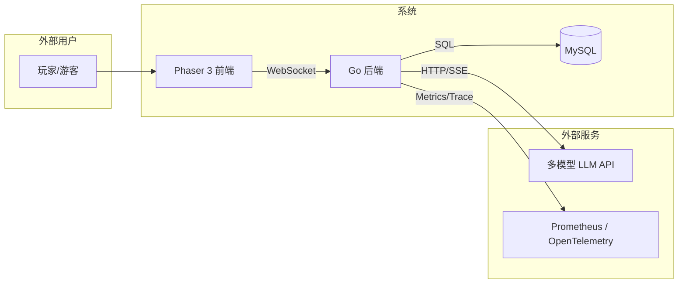
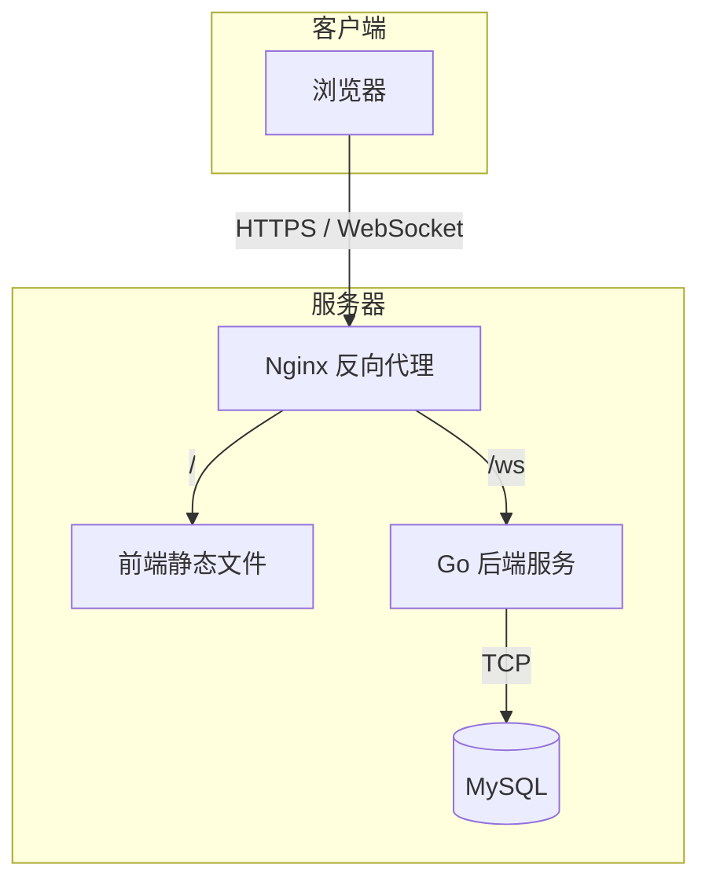
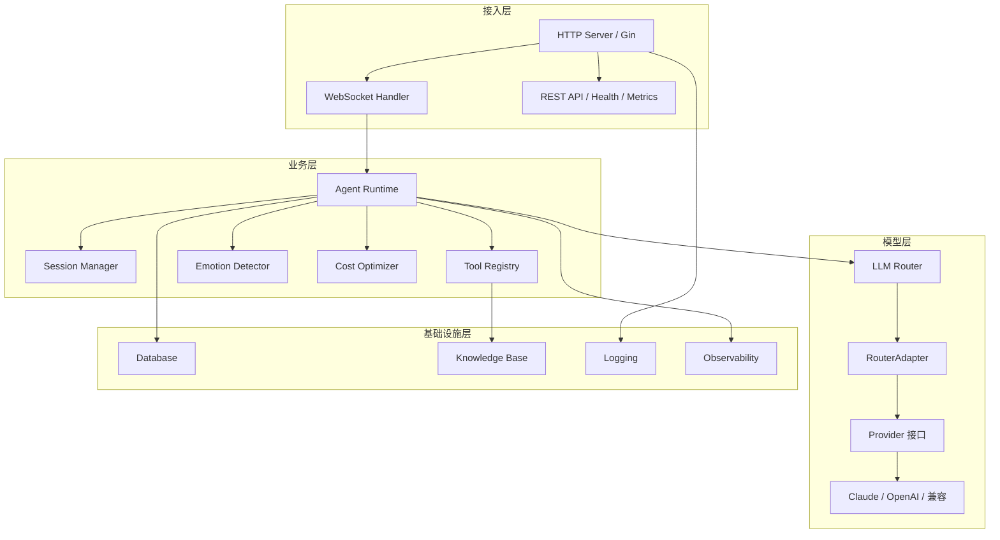
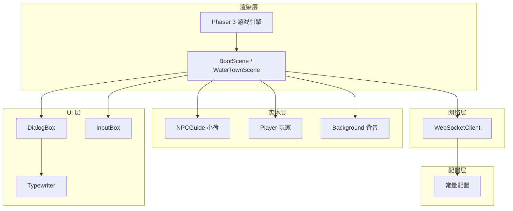
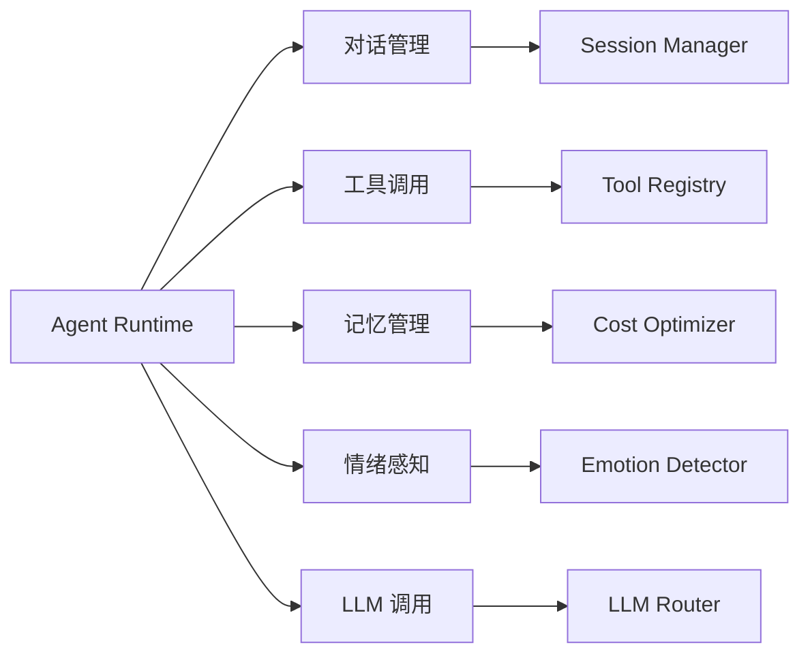
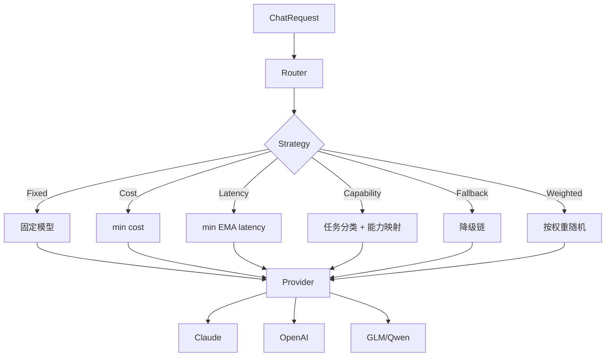
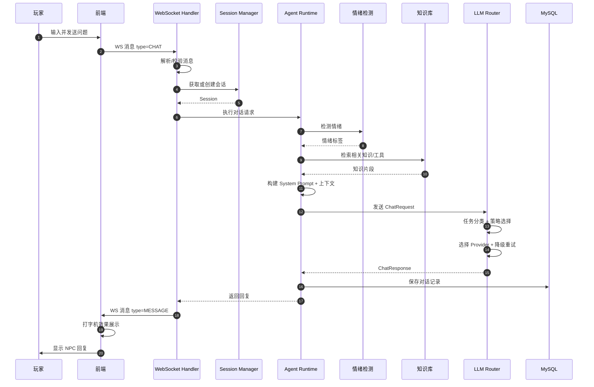
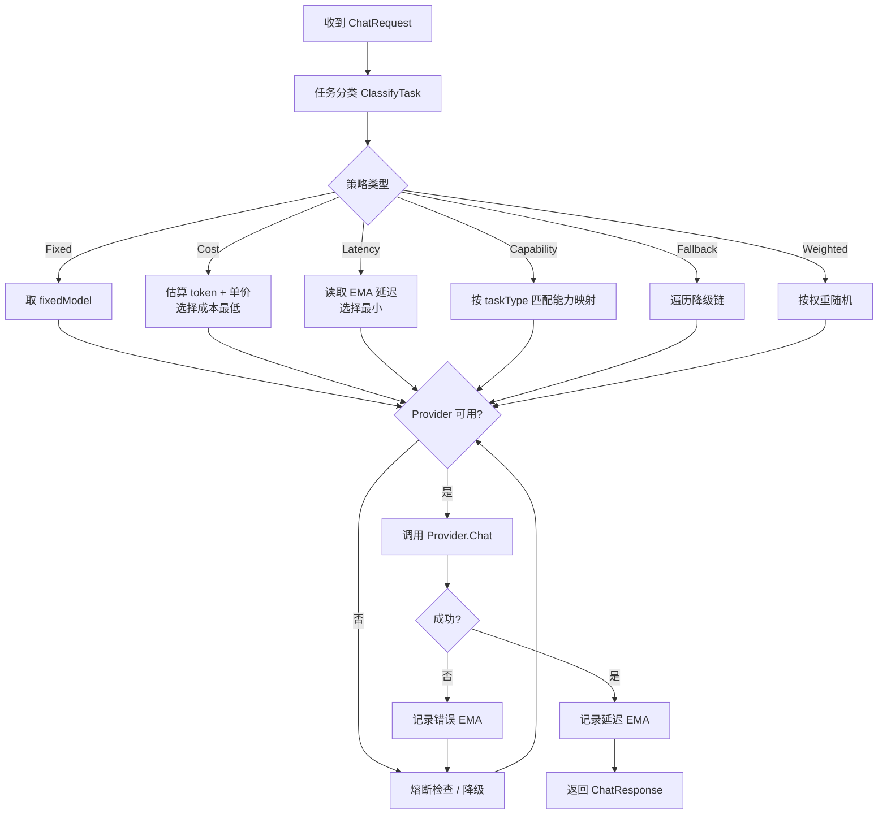
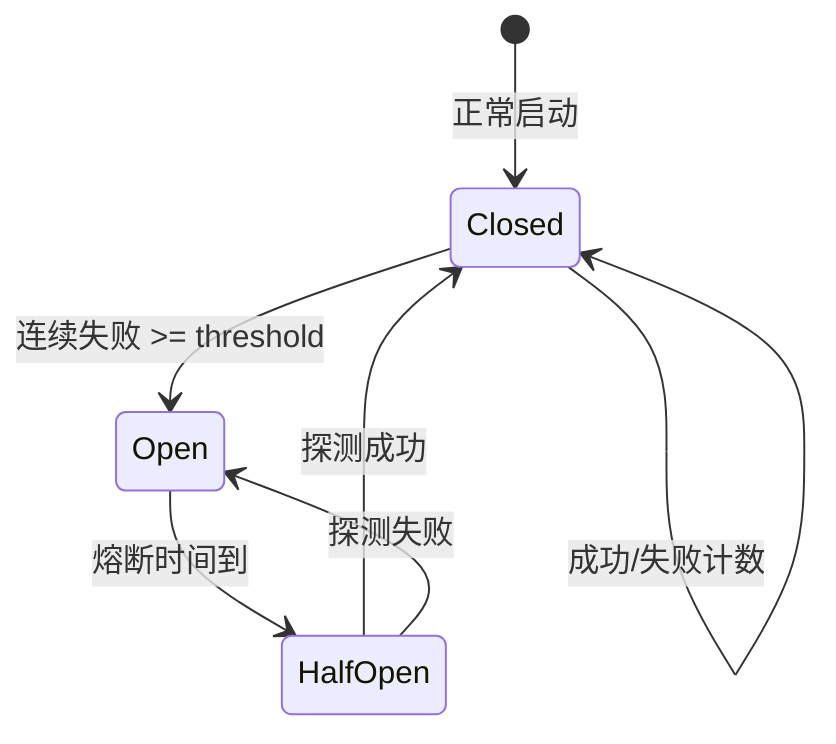
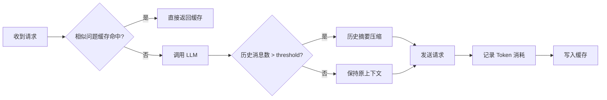

# 系统架构文档

> 本文档从系统架构视角出发，详细说明江南水乡智能导游系统的整体架构、核心模块、关键流程与设计决策。


---

## 目录

- [1. 总体架构](#1-总体架构)
- [2. 分层架构](#2-分层架构)
- [3. 核心模块](#3-核心模块)
- [4. 关键流程图](#4-关键流程图)
- [5. 数据模型](#5-数据模型)
- [6. 设计决策](#6-设计决策)
- [7. 常见问题与设计 FAQ](#7-常见问题与设计-faq)


---

## 1. 总体架构

### 系统边界



### 部署架构



---

## 2. 分层架构

### 后端分层



### 前端分层



---

## 3. 核心模块

### 3.1 WebSocket 模块

| 组件 | 职责 |
|------|------|
| `websocket.Hub` | 管理所有客户端连接、广播消息 |
| `websocket.Client` | 单个客户端连接、读写协程 |
| `WebSocketHandler` | 处理业务消息、连接生命周期 |
| `Message` | 统一消息协议 `{type, requestId, tenantId, timestamp, payload}` |

**特点**：
- 每个连接独立 `readPump` / `writePump` 协程
- 心跳保活（Ping/Pong）
- 断线自动重连（前端实现）
- 消息类型化：聊天、系统、错误、心跳

### 3.2 Agent Runtime



### 3.3 多模型 LLM 路由



---

## 4. 关键流程图

### 4.1 玩家发起一次对话的完整流程



### 4.2 多模型路由选择流程



### 4.3 熔断器状态机



### 4.4 成本优化流程



---

## 5. 数据模型

### 核心数据库表

| 表名 | 用途 |
|------|------|
| `players` | 玩家信息 |
| `conversations` | 对话记录 |
| `audit_logs` | 审计日志（多租户） |

### 消息协议

```json
{
  "type": "CHAT",
  "requestId": "req_001",
  "tenantId": "tenant_001",
  "timestamp": 1718457600000,
  "payload": {
    "content": "苏州有什么好玩的？"
  }
}
```

### 回复协议

```json
{
  "type": "MESSAGE",
  "requestId": "req_001",
  "timestamp": 1718457601000,
  "payload": {
    "content": "苏州有拙政园、虎丘、平江路...",
    "emotion": "happy"
  }
}
```

---

## 6. 设计决策

### 6.1 为什么使用 WebSocket 而不是 HTTP 轮询？

| 维度 | WebSocket | HTTP 轮询 |
|------|-----------|-----------|
| 实时性 | 双向推送，毫秒级 | 依赖轮询间隔 |
| 资源消耗 | 长连接，低 overhead | 高频请求消耗大 |
| 游戏体验 | 支持 NPC 实时打字机效果 | 体验差 |

### 6.2 为什么自研多模型路由而不是使用 LangChain？

| 维度 | 自研路由 | LangChain |
|------|----------|-----------|
| 控制力 | 完全控制策略、降级、统计 | 受框架限制 |
| 性能 | 无额外抽象层，轻量 | 框架 overhead |
| 可观测 | 自定义 EMA、指标 | 通用指标 |
| 学习价值 | 深入理解模型调度 | 框架封装 |

### 6.3 为什么使用 EMA 而不是简单平均？

- **响应速度**：新样本权重 30%，能快速反映模型当前状态。
- **稳定性**：历史权重 70%，避免单次异常抖动影响决策。
- **内存高效**：无需保存所有历史数据，只维护一个 EMA 值。

### 6.4 为什么降级链优先于成本？

- **可用性优先**：用户请求失败比使用更贵的模型更糟糕。
- **渐进降级**：从高性能模型到低成本模型，平衡质量与成本。
- **容错能力**：单一模型故障不影响整体服务。

---

## 7. 常见问题与设计 FAQ


### Q1：项目最大的技术难点是什么？

**答**：多模型路由与降级机制。难点在于：
1. 如何抽象统一的 Provider 接口，兼容 Claude、OpenAI 和 OpenAI 兼容格式的 API；
2. 如何动态选择模型并保证可用性；
3. 如何统计运行时指标并用于路由决策。

我们设计了 `model.Provider` 接口、`Router` 策略引擎、`ModelStats` EMA 统计三层结构，实现了应用层与具体模型的解耦。

### Q2：如果某个模型挂了，系统怎么办？

**答**：
1. 熔断器检测到连续失败，进入 Open 状态，快速失败；
2. Fallback 策略按降级链尝试下一个模型；
3. 如果所有模型都失败，FallbackAdapter 返回预设兜底回复；
4. 同时 EMA 错误率更新，高错误模型被快速降级。

### Q3：如何控制 API 成本？

**答**：
1. 成本优先策略自动选择单价最低的模型；
2. 相似问题缓存命中直接返回；
3. 历史消息超过阈值自动摘要，减少 token；
4. 本地 Token 估算，无需调用 API 即可预估成本。

### Q4：前后端如何保持状态？

**答**：
- WebSocket 长连接维持玩家会话；
- Session Manager 管理每个玩家的对话上下文；
- MySQL 持久化对话记录；
- 前端断开重连后通过 requestId / playerId 恢复会话。

### Q5：项目的可扩展性如何？

**答**：
- 新增 Provider：实现 `model.Provider` 接口即可；
- 新增路由策略：在 `router` 中添加策略分支；
- 新增工具：实现 `agent.Tool` 接口并注册到 `ToolRegistry`；
- 前端新增场景：新增 Phaser Scene 即可。

---

## 附录：技术栈

| 层级 | 技术 |
|------|------|
| 后端语言 | Go 1.25+ |
| HTTP 框架 | Gin |
| WebSocket | Gorilla WebSocket |
| 数据库 | MySQL 8.0 |
| ORM | GORM |
| LLM SDK | anthropic-sdk-go, go-openai |
| 可观测 | Prometheus, OpenTelemetry |
| 前端引擎 | Phaser 3 |
| 部署 | Docker, Render |

---

*本文档用于项目介绍和技术分享，建议结合代码和流程图进行讲解。*

