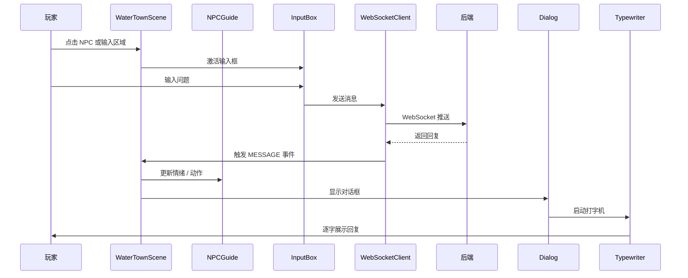

# 江南水乡智能导游系统 - 前端

基于 Phaser 3 的 2D 像素风格游戏前端，通过 WebSocket 与后端通信，实现智能 NPC 导游对话。

## 技术栈

- **Phaser 3** - 2D 游戏引擎
- **原生 JavaScript** - 无框架依赖
- **WebSocket** - 实时双向通信
- **Nginx** - 静态文件服务（生产环境）

## 项目结构

```
frontend/
├── index.html              # 入口页面
├── package.json            # 依赖配置
├── Dockerfile              # Docker 构建文件
├── nginx.conf              # Nginx 配置
├── css/
│   └── styles.css          # 全局样式
└── js/
    ├── main.js             # 游戏主入口
    ├── utils/
    │   └── const.js        # 常量定义
    ├── network/
    │   └── websocket.js    # WebSocket 客户端
    ├── ui/
    │   ├── Typewriter.js   # 打字机效果
    │   ├── DialogBox.js    # 对话框组件
    │   └── InputBox.js     # 输入框组件
    ├── entities/
    │   ├── NPCGuide.js     # NPC 导游实体
    │   ├── Player.js       # 玩家实体
    │   └── Background.js   # 背景场景
    └── scenes/
        ├── BootScene.js    # 启动场景
        └── WaterTownScene.js   # 水乡主场景
```

## 快速开始

### 环境要求

- Node.js 16+（开发用）
- 现代浏览器（Chrome / Firefox / Edge）

### 本地开发

1. 安装依赖：
```bash
npm install
```

2. 启动开发服务器：
```bash
npm run dev
```

访问 `http://localhost:8084`，游戏将自动打开。

### 手动启动

```bash
npx http-server -p 8084
```

## 游戏配置

编辑 `js/utils/const.js` 修改游戏参数：

| 配置项 | 默认值 | 说明 |
|--------|--------|------|
| `GAME_CONFIG.width` | 1200 | 画布宽度 |
| `GAME_CONFIG.height` | 800 | 画布高度 |
| `WS_CONFIG.url` | `ws://localhost:8080/ws/game` | WebSocket 地址 |
| `WS_CONFIG.reconnectInterval` | 3000 | 重连间隔（ms） |
| `WS_CONFIG.pingInterval` | 30000 | 心跳间隔（ms） |

## 核心模块

### WebSocketClient

负责与后端的 WebSocket 通信，支持：
- 自动重连
- 心跳保活
- 消息队列（断线时缓存）
- 玩家 ID 同步

### DialogBox

游戏内对话框 UI，支持：
- NPC 对话展示
- 打字机逐字显示效果
- 多行文本自动换行
- 情绪状态显示

### NPCGuide

NPC 导游实体，包含：
- 角色动画
- 对话触发逻辑
- 情绪状态展示

## 视觉特性

- **江南水乡主题**：水墨风格背景
- **古风少女导游**：NPC 角色"小荷"
- **半透明 UI**：现代化的对话框设计
- **打字机效果**：逐字显示对话内容

## 前端游戏流程图



## 前端技术亮点

### 1. 为什么选择 Phaser 3？

- 专门的 2D 游戏引擎，内置场景、动画、碰撞、输入处理。
- 原生 JavaScript 即可使用，无需复杂前端框架。
- 适合像素风、轻量级游戏场景。

### 2. WebSocket 客户端如何保障稳定性？

| 机制 | 作用 |
|------|------|
| 自动重连 | 断线后按指数退避重试 |
| 心跳保活 | 定时发送 Ping，防止中间件断开连接 |
| 消息队列 | 断线时缓存消息，恢复后批量发送 |
| 玩家 ID 同步 | 重连后恢复会话状态 |

### 3. 打字机效果如何提升用户体验？

- 将 NPC 回复逐字显示，模拟真实对话节奏。
- 支持多行文本自动换行、情绪状态展示。
- 增强游戏沉浸感和"小荷"角色生命力。

### 4. 前后端交互协议设计

```json
{
  "type": "CHAT",
  "requestId": "req_001",
  "tenantId": "tenant_001",
  "timestamp": 1718457600000,
  "payload": { "content": "苏州有什么好玩的？" }
}
```

- `type`：消息类型，便于前端路由处理。
- `requestId`：用于请求追踪和日志串联。
- `tenantId`：支持多租户隔离。
- `payload`：业务数据，结构灵活。

## Docker 运行

```bash
cd frontend
docker build -t watertown-frontend .
docker run -p 8084:80 watertown-frontend
```

## 生产部署

生产环境建议使用 Nginx 反向代理：

```nginx
server {
    listen 80;
    server_name your-domain.com;

    # 前端静态文件
    location / {
        root /usr/share/nginx/html;
        try_files $uri $uri/ /index.html;
    }

    # WebSocket 代理
    location /ws/ {
        proxy_pass http://backend:8080;
        proxy_http_version 1.1;
        proxy_set_header Upgrade $http_upgrade;
        proxy_set_header Connection "upgrade";
    }
}
```

## 许可证

MIT